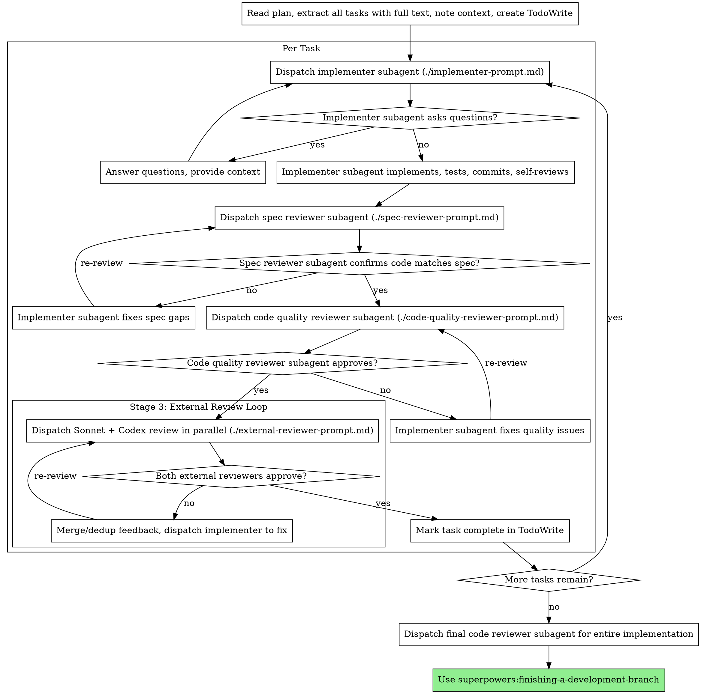

# External Review Loop Implementation Plan

> **For agentic workers:** REQUIRED SUB-SKILL: Use superpowers:subagent-driven-development (recommended) or superpowers:executing-plans to implement this plan task-by-task. Steps use checkbox (`- [ ]`) syntax for tracking.

**Goal:** Add a cross-model external review stage (Sonnet + Codex in parallel) to subagent-driven-development, and expand code quality review with performance, consistency, and design dimensions.

**Architecture:** Extend the existing per-task flow in `subagent-driven-development` with a third review stage. After internal spec compliance and expanded code quality reviews pass, dispatch Sonnet (via Agent tool `model: "sonnet"`) and Codex (via `/codex:review`) in parallel. Merge feedback, fix via implementer subagent, loop until both approve.

**Tech Stack:** Markdown skill files (no code dependencies). Relies on Claude Code Agent tool with `model` parameter, and `codex-plugin-cc` for `/codex:review`.

---

### Task 1: Expand code-quality-reviewer-prompt.md with Performance, Consistency, and Design dimensions

**Files:**
- Modify: `skills/subagent-driven-development/code-quality-reviewer-prompt.md`

- [ ] **Step 1: Read current file**

Read `skills/subagent-driven-development/code-quality-reviewer-prompt.md` to confirm current content matches what we expect.

- [ ] **Step 2: Replace file content with expanded version**

Replace the entire content of `skills/subagent-driven-development/code-quality-reviewer-prompt.md` with:

```markdown
# Code Quality Reviewer Prompt Template

Use this template when dispatching a code quality reviewer subagent.

**Purpose:** Verify implementation is well-built (clean, tested, maintainable, performant, consistent, well-designed)

**Only dispatch after spec compliance review passes.**

` ` `
Task tool (superpowers:code-reviewer):
  Use template at requesting-code-review/code-reviewer.md

  WHAT_WAS_IMPLEMENTED: [from implementer's report]
  PLAN_OR_REQUIREMENTS: Task N from [plan-file]
  BASE_SHA: [commit before task]
  HEAD_SHA: [current commit]
  DESCRIPTION: [task summary]
` ` `

**In addition to standard code quality concerns, the reviewer should check:**
- Does each file have one clear responsibility with a well-defined interface?
- Are units decomposed so they can be understood and tested independently?
- Is the implementation following the file structure from the plan?
- Did this implementation create new files that are already large, or significantly grow existing files? (Don't flag pre-existing file sizes — focus on what this change contributed.)

**Performance:**
- Are there unnecessary repeated computations, N+1 queries, or unbounded loops?
- Are data structure choices appropriate for the access patterns?
- Are there obvious performance bottlenecks?

**Consistency:**
- Do naming, error handling, and logging style match the existing codebase?
- Are API design patterns unified with the rest of the project?
- Does this change introduce conflicting new patterns?

**Design:**
- Are abstraction levels appropriate and responsibilities clear?
- Is the dependency direction correct?
- Is the implementation neither over-engineered nor under-designed?

**Code reviewer returns:**

` ` `
Strengths:
Issues:
  - Critical: ...
  - Important: ...
  - Minor: ...
Performance:
  - ...
Consistency:
  - ...
Design:
  - ...
Assessment: Approved / Needs Fix
` ` `
```

**Note:** The triple backticks inside the code block above are escaped with spaces (`` ` ` ` ``) to avoid markdown nesting issues. When writing the actual file, use real triple backticks (`` ``` ``).

- [ ] **Step 3: Verify the file reads correctly**

Read `skills/subagent-driven-development/code-quality-reviewer-prompt.md` and confirm:
- The three new sections (Performance, Consistency, Design) are present
- The expanded output format is shown
- The original checklist items are preserved

- [ ] **Step 4: Commit**

```bash
git add skills/subagent-driven-development/code-quality-reviewer-prompt.md
git commit -m "feat: expand code quality review with performance, consistency, and design dimensions"
```

---

### Task 2: Create external-reviewer-prompt.md

**Files:**
- Create: `skills/subagent-driven-development/external-reviewer-prompt.md`

- [ ] **Step 1: Create the external reviewer prompt template**

Create `skills/subagent-driven-development/external-reviewer-prompt.md` with this content:

```markdown
# External Reviewer Prompt Template

Use this template when dispatching a Sonnet subagent for cross-model external review.

**Purpose:** Provide an independent cross-model perspective on code that has already passed internal spec compliance and code quality review. Catch blind spots that same-model review misses.

**Only dispatch after both spec compliance and code quality reviews pass.**

` ` `
Task tool (general-purpose):
  model: "sonnet"
  description: "External review for Task N: [task name]"
  prompt: |
    You are an independent external code reviewer. The code you are reviewing has
    already passed two internal review stages:
    1. Spec compliance review (confirmed: implements exactly what was requested)
    2. Code quality review (confirmed: clean, tested, maintainable, performant, consistent, well-designed)

    Your job is to provide a DIFFERENT perspective. Do not repeat what internal
    reviewers already checked. Focus on what they might have missed.

    ## Task Spec

    [FULL TEXT of task requirements]

    ## Changed Files

    [List of files changed by this task]

    ## Git Diff

    Review the diff for this task:

    ```bash
    git diff {BASE_SHA}..{HEAD_SHA}
    ```

    ## Focus Areas

    **Cross-task consistency:**
    - Does this task's implementation style match other tasks in the same plan?
    - Are there naming or pattern inconsistencies across the broader codebase?

    **Blind spots:**
    - Edge cases that both the implementer and internal reviewer might share assumptions about
    - Concurrency, race conditions, or ordering issues
    - Error propagation paths that cross module boundaries
    - Implicit assumptions about input data or environment

    **Broader design perspective:**
    - Does this change make the system harder to understand or modify?
    - Are there simpler alternatives the implementer may not have considered?
    - Will this approach cause problems as the system grows?

    **Security:**
    - Input validation gaps
    - Injection vectors
    - Authentication/authorization bypasses

    ## Output Format

    Issues:
      - Critical: [must fix before proceeding]
      - Important: [should fix before proceeding]
      - Minor: [note for future improvement]
    Assessment: Approved / Needs Fix

    If you find no issues beyond what internal review already covered, report:
    Assessment: Approved — no additional issues found.

    Do NOT manufacture issues. If the code is solid, say so.
` ` `
```

**Note:** The triple backticks inside the code block above are escaped with spaces (`` ` ` ` ``) to avoid markdown nesting issues. When writing the actual file, use real triple backticks (`` ``` ``).

- [ ] **Step 2: Verify the file reads correctly**

Read `skills/subagent-driven-development/external-reviewer-prompt.md` and confirm:
- The prompt includes all four focus areas (cross-task consistency, blind spots, broader design, security)
- The `model: "sonnet"` is specified in the Task tool dispatch
- The output format matches the spec (Issues with severity + Assessment)
- The note about not manufacturing issues is present

- [ ] **Step 3: Commit**

```bash
git add skills/subagent-driven-development/external-reviewer-prompt.md
git commit -m "feat: add external reviewer prompt template for cross-model review"
```

---

### Task 3: Update SKILL.md with Stage 3 external review loop

**Files:**
- Modify: `skills/subagent-driven-development/SKILL.md`

This is the largest task. It updates the main skill document with the new Stage 3, revised flow diagram, updated prompt template list, updated example workflow, and new Red Flags.

- [ ] **Step 1: Read current file**

Read `skills/subagent-driven-development/SKILL.md` to confirm current content.

- [ ] **Step 2: Update opening description**

Replace the first two paragraphs (lines 7-12) from:

```
Execute plan by dispatching fresh subagent per task, with two-stage review after each: spec compliance review first, then code quality review.
```

to:

```
Execute plan by dispatching fresh subagent per task, with three-stage review after each: spec compliance review, expanded code quality review (performance, consistency, design), then cross-model external review (Sonnet + Codex in parallel).
```

And update the core principle from:

```
**Core principle:** Fresh subagent per task + two-stage review (spec then quality) = high quality, fast iteration
```

to:

```
**Core principle:** Fresh subagent per task + three-stage review (spec → quality → external cross-model) = high quality, fast iteration
```

- [ ] **Step 3: Update the "vs. Executing Plans" comparison**

Replace line 37:

```
- Two-stage review after each task: spec compliance first, then code quality
```

with:

```
- Three-stage review after each task: spec compliance, code quality (expanded), external cross-model (Sonnet + Codex)
```

- [ ] **Step 4: Update the process flow diagram**

Replace the entire `digraph process` block (lines 42-84) with:



- [ ] **Step 5: Update Prompt Templates section**

Replace the Prompt Templates section (lines 120-124) from:

```
## Prompt Templates

- `./implementer-prompt.md` - Dispatch implementer subagent
- `./spec-reviewer-prompt.md` - Dispatch spec compliance reviewer subagent
- `./code-quality-reviewer-prompt.md` - Dispatch code quality reviewer subagent
```

to:

```
## Prompt Templates

- `./implementer-prompt.md` - Dispatch implementer subagent
- `./spec-reviewer-prompt.md` - Dispatch spec compliance reviewer subagent
- `./code-quality-reviewer-prompt.md` - Dispatch code quality reviewer subagent (expanded: +performance, +consistency, +design)
- `./external-reviewer-prompt.md` - Dispatch Sonnet external reviewer subagent (cross-model review)
```

- [ ] **Step 6: Add External Review Loop section after the Example Workflow**

After the existing Example Workflow section (after line 200), insert a new section:

```markdown
## External Review Loop

After internal reviews (spec compliance + code quality) pass, the controller dispatches two external reviewers **in parallel**:

**Sonnet subagent:** Dispatched via Agent tool with `model: "sonnet"`. Uses `./external-reviewer-prompt.md` template. Focuses on blind spots, cross-task consistency, broader design, and security.

**Codex review:** Invoked via `/codex:review` from `codex-plugin-cc`. Reviews the committed diff (BASE_SHA..HEAD_SHA). Async flow:
1. Invoke `/codex:review` with the branch diff from task start to current HEAD
2. Poll `/codex:status` until complete
3. Retrieve results via `/codex:result`

**Feedback merge:** Controller collects both results, merges and deduplicates issues (same issue flagged by both → single item), then dispatches implementer subagent with the merged issue list.

**Exit condition:** Both Sonnet and Codex must approve. Loop continues until both pass.

### External Review Example

```
[After internal reviews pass for Task 2]

[Record BASE_SHA before task, HEAD_SHA after task]

[Dispatch in parallel:]
  1. Sonnet subagent (model: "sonnet") with external-reviewer-prompt.md
  2. /codex:review for BASE_SHA..HEAD_SHA

[Wait for both to return]

Sonnet: Issues:
  - Important: Race condition in concurrent access to shared cache (utils.ts:45)
  Assessment: Needs Fix

Codex: LGTM, no issues found.

[Merge feedback: 1 Important issue from Sonnet]
[Dispatch implementer subagent to fix race condition]

Implementer: Added mutex lock around cache access. Tests updated.

[Re-dispatch both external reviewers in parallel]

Sonnet: Assessment: Approved — race condition properly addressed.
Codex: No issues found.

[Both approved → Mark Task 2 complete]
```
```

- [ ] **Step 7: Update the Quality gates subsection in Advantages**

Replace the Quality gates subsection (lines 221-226) from:

```
**Quality gates:**
- Self-review catches issues before handoff
- Two-stage review: spec compliance, then code quality
- Review loops ensure fixes actually work
- Spec compliance prevents over/under-building
- Code quality ensures implementation is well-built
```

to:

```
**Quality gates:**
- Self-review catches issues before handoff
- Three-stage review: spec compliance, code quality (expanded), external cross-model
- Review loops ensure fixes actually work at each stage
- Spec compliance prevents over/under-building
- Code quality ensures implementation is well-built, performant, consistent, well-designed
- External cross-model review catches blind spots that same-model review misses
```

- [ ] **Step 8: Update the Cost subsection in Advantages**

Replace the Cost subsection (lines 228-231) from:

```
**Cost:**
- More subagent invocations (implementer + 2 reviewers per task)
- Controller does more prep work (extracting all tasks upfront)
- Review loops add iterations
- But catches issues early (cheaper than debugging later)
```

to:

```
**Cost:**
- More subagent invocations (implementer + 2 internal reviewers + 2 external reviewers per task)
- External review loop adds Sonnet API cost + Codex API cost per task
- Controller does more prep work (extracting all tasks upfront, merging external feedback)
- Review loops add iterations at each stage
- But catches issues early (cheaper than debugging later)
- Cross-model review is the most expensive stage — justified by catching blind spots
```

- [ ] **Step 9: Update Red Flags section**

Add these items to the "Never:" list in the Red Flags section (after line 248 "Move to next task while either review has open issues"):

```
- **Skip external review after internal reviews pass** (all three stages are mandatory)
- **Start external review before code quality review is ✅** (wrong order: spec → quality → external)
- **Proceed when only one external reviewer approves** (both Sonnet AND Codex must approve)
- **Send unfixed internal review issues to external review** (fix internal issues first)
```

And add a new subsection after "If subagent fails task:" (after line 263):

```
**If external reviewers disagree:**
- If one approves and one finds issues, fix the issues and re-submit to both
- If both find different issues, merge and dedup, fix all, re-submit to both
- Never cherry-pick which reviewer's feedback to address — fix everything
```

- [ ] **Step 10: Verify the complete file**

Read the entire updated `skills/subagent-driven-development/SKILL.md` and verify:
- Opening description says "three-stage review"
- Flow diagram includes the external review loop cluster
- Prompt Templates lists all four templates including `external-reviewer-prompt.md`
- External Review Loop section is present with example
- Quality gates mention three stages and cross-model review
- Cost section mentions external review costs
- Red Flags include external review rules
- No broken references or inconsistencies

- [ ] **Step 11: Commit**

```bash
git add skills/subagent-driven-development/SKILL.md
git commit -m "feat: add Stage 3 external review loop (Sonnet + Codex) to subagent-driven-development"
```

---

### Task 4: Update requesting-code-review/SKILL.md with expanded review dimensions

**Files:**
- Modify: `skills/requesting-code-review/SKILL.md`

- [ ] **Step 1: Read current file**

Read `skills/requesting-code-review/SKILL.md` to confirm current content.

- [ ] **Step 2: Update the "Integration with Workflows" section**

Replace the "Subagent-Driven Development:" subsection (lines 79-82) from:

```
**Subagent-Driven Development:**
- Review after EACH task
- Catch issues before they compound
- Fix before moving to next task
```

to:

```
**Subagent-Driven Development:**
- Three-stage review after EACH task: spec compliance, code quality (expanded with performance, consistency, design), external cross-model (Sonnet + Codex)
- Catch issues before they compound
- Fix before moving to next task
- External reviewers provide independent cross-model perspective
```

- [ ] **Step 3: Verify the file reads correctly**

Read `skills/requesting-code-review/SKILL.md` and confirm the updated section is present and consistent with the changes in SKILL.md.

- [ ] **Step 4: Commit**

```bash
git add skills/requesting-code-review/SKILL.md
git commit -m "feat: update requesting-code-review to reflect three-stage review workflow"
```
