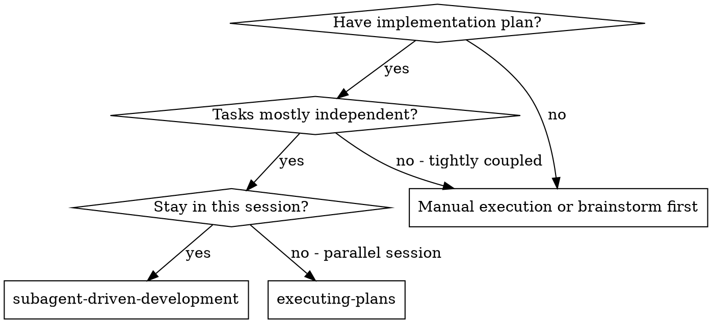

# Subagent-Driven Development

Execute plan by dispatching fresh subagent per task, with three-stage review after each: spec compliance review, expanded code quality review (performance, consistency, design), then cross-model external review (Sonnet + Codex in parallel).

**Why subagents:** You delegate tasks to specialized agents with isolated context. By precisely crafting their instructions and context, you ensure they stay focused and succeed at their task. They should never inherit your session's context or history — you construct exactly what they need. This also preserves your own context for coordination work.

**Core principle:** Fresh subagent per task + three-stage review (spec → quality → external cross-model) = high quality, fast iteration

## When to Use



**vs. Executing Plans (parallel session):**
- Same session (no context switch)
- Fresh subagent per task (no context pollution)
- Three-stage review after each task: spec compliance, code quality (expanded), external cross-model (Sonnet + Codex)
- Faster iteration (no human-in-loop between tasks)

## The Process

```dot
digraph process {
    rankdir=TB;

    subgraph cluster_per_task {
        label="Per Task";
        "Dispatch implementer subagent (./implementer-prompt.md)" [shape=box];
        "Implementer subagent asks questions?" [shape=diamond];
        "Answer questions, provide context" [shape=box];
        "Implementer subagent implements, tests, commits, self-reviews" [shape=box];
        "Dispatch spec reviewer subagent (./spec-reviewer-prompt.md)" [shape=box];
        "Spec reviewer subagent confirms code matches spec?" [shape=diamond];
        "Implementer subagent fixes spec gaps" [shape=box];
        "Dispatch code quality reviewer subagent (./code-quality-reviewer-prompt.md)" [shape=box];
        "Code quality reviewer subagent approves?" [shape=diamond];
        "Implementer subagent fixes quality issues" [shape=box];

        subgraph cluster_external {
            label="Stage 3: External Review Loop";
            "Dispatch Sonnet + Codex review in parallel (./external-reviewer-prompt.md)" [shape=box];
            "Both external reviewers approve?" [shape=diamond];
            "Merge/dedup feedback, dispatch implementer to fix" [shape=box];
        }

        "Mark task complete in TodoWrite" [shape=box];
    }

    "Read plan, extract all tasks with full text, note context, create TodoWrite" [shape=box];
    "More tasks remain?" [shape=diamond];
    "Dispatch final code reviewer subagent for entire implementation" [shape=box];
    "Use superpowers:finishing-a-development-branch" [shape=box style=filled fillcolor=lightgreen];

    "Read plan, extract all tasks with full text, note context, create TodoWrite" -> "Dispatch implementer subagent (./implementer-prompt.md)";
    "Dispatch implementer subagent (./implementer-prompt.md)" -> "Implementer subagent asks questions?";
    "Implementer subagent asks questions?" -> "Answer questions, provide context" [label="yes"];
    "Answer questions, provide context" -> "Dispatch implementer subagent (./implementer-prompt.md)";
    "Implementer subagent asks questions?" -> "Implementer subagent implements, tests, commits, self-reviews" [label="no"];
    "Implementer subagent implements, tests, commits, self-reviews" -> "Dispatch spec reviewer subagent (./spec-reviewer-prompt.md)";
    "Dispatch spec reviewer subagent (./spec-reviewer-prompt.md)" -> "Spec reviewer subagent confirms code matches spec?";
    "Spec reviewer subagent confirms code matches spec?" -> "Implementer subagent fixes spec gaps" [label="no"];
    "Implementer subagent fixes spec gaps" -> "Dispatch spec reviewer subagent (./spec-reviewer-prompt.md)" [label="re-review"];
    "Spec reviewer subagent confirms code matches spec?" -> "Dispatch code quality reviewer subagent (./code-quality-reviewer-prompt.md)" [label="yes"];
    "Dispatch code quality reviewer subagent (./code-quality-reviewer-prompt.md)" -> "Code quality reviewer subagent approves?";
    "Code quality reviewer subagent approves?" -> "Implementer subagent fixes quality issues" [label="no"];
    "Implementer subagent fixes quality issues" -> "Dispatch code quality reviewer subagent (./code-quality-reviewer-prompt.md)" [label="re-review"];
    "Code quality reviewer subagent approves?" -> "Dispatch Sonnet + Codex review in parallel (./external-reviewer-prompt.md)" [label="yes"];
    "Dispatch Sonnet + Codex review in parallel (./external-reviewer-prompt.md)" -> "Both external reviewers approve?";
    "Both external reviewers approve?" -> "Merge/dedup feedback, dispatch implementer to fix" [label="no"];
    "Merge/dedup feedback, dispatch implementer to fix" -> "Dispatch spec reviewer subagent (./spec-reviewer-prompt.md)" [label="re-run internal reviews"];
    "Both external reviewers approve?" -> "Mark task complete in TodoWrite" [label="yes"];
    "Mark task complete in TodoWrite" -> "More tasks remain?";
    "More tasks remain?" -> "Dispatch implementer subagent (./implementer-prompt.md)" [label="yes"];
    "More tasks remain?" -> "Dispatch final code reviewer subagent for entire implementation" [label="no"];
    "Dispatch final code reviewer subagent for entire implementation" -> "Use superpowers:finishing-a-development-branch";
}
```



## Model Selection

Use the least powerful model that can handle each role to conserve cost and increase speed.

**Mechanical implementation tasks** (isolated functions, clear specs, 1-2 files): use a fast, cheap model. Most implementation tasks are mechanical when the plan is well-specified.

**Integration and judgment tasks** (multi-file coordination, pattern matching, debugging): use a standard model.

**Architecture, design, and review tasks**: use the most capable available model.

**Task complexity signals:**
- Touches 1-2 files with a complete spec → cheap model
- Touches multiple files with integration concerns → standard model
- Requires design judgment or broad codebase understanding → most capable model

## Handling Implementer Status

Implementer subagents report one of four statuses. Handle each appropriately:

**DONE:** Proceed to spec compliance review.

**DONE_WITH_CONCERNS:** The implementer completed the work but flagged doubts. Read the concerns before proceeding. If the concerns are about correctness or scope, address them before review. If they're observations (e.g., "this file is getting large"), note them and proceed to review.

**NEEDS_CONTEXT:** The implementer needs information that wasn't provided. Provide the missing context and re-dispatch.

**BLOCKED:** The implementer cannot complete the task. Assess the blocker:
1. If it's a context problem, provide more context and re-dispatch with the same model
2. If the task requires more reasoning, re-dispatch with a more capable model
3. If the task is too large, break it into smaller pieces
4. If the plan itself is wrong, escalate to the human

**Never** ignore an escalation or force the same model to retry without changes. If the implementer said it's stuck, something needs to change.

## Prompt Templates

- `./implementer-prompt.md` - Dispatch implementer subagent
- `./spec-reviewer-prompt.md` - Dispatch spec compliance reviewer subagent
- `./code-quality-reviewer-prompt.md` - Dispatch code quality reviewer subagent (expanded: +performance, +consistency, +design)
- `./external-reviewer-prompt.md` - Dispatch Sonnet external reviewer subagent (cross-model review)

## Example Workflow

```
You: I'm using Subagent-Driven Development to execute this plan.

[Read plan file once: docs/superpowers/plans/feature-plan.md]
[Extract all 5 tasks with full text and context]
[Create TodoWrite with all tasks]

Task 1: Hook installation script

[Get Task 1 text and context (already extracted)]
[Dispatch implementation subagent with full task text + context]

Implementer: "Before I begin - should the hook be installed at user or system level?"

You: "User level (~/.config/superpowers/hooks/)"

Implementer: "Got it. Implementing now..."
[Later] Implementer:
  - Implemented install-hook command
  - Added tests, 5/5 passing
  - Self-review: Found I missed --force flag, added it
  - Committed

[Dispatch spec compliance reviewer]
Spec reviewer: ✅ Spec compliant - all requirements met, nothing extra

[Get git SHAs, dispatch code quality reviewer]
Code reviewer: Strengths: Good test coverage, clean. Issues: None. Approved.

[Dispatch external reviewers in parallel: Sonnet + /codex:review]
Sonnet: Assessment: Approved — no additional issues found.
Codex: No issues found.

[Mark Task 1 complete]

Task 2: Recovery modes

[Get Task 2 text and context (already extracted)]
[Dispatch implementation subagent with full task text + context]

Implementer: [No questions, proceeds]
Implementer:
  - Added verify/repair modes
  - 8/8 tests passing
  - Self-review: All good
  - Committed

[Dispatch spec compliance reviewer]
Spec reviewer: ❌ Issues:
  - Missing: Progress reporting (spec says "report every 100 items")
  - Extra: Added --json flag (not requested)

[Implementer fixes issues]
Implementer: Removed --json flag, added progress reporting

[Spec reviewer reviews again]
Spec reviewer: ✅ Spec compliant now

[Dispatch code quality reviewer]
Code reviewer: Strengths: Solid. Issues (Important): Magic number (100)

[Implementer fixes]
Implementer: Extracted PROGRESS_INTERVAL constant

[Code reviewer reviews again]
Code reviewer: ✅ Approved

[Dispatch external reviewers in parallel: Sonnet + /codex:review]
Sonnet: Issues:
  - Minor: Consider extracting progress reporting into a reusable utility
  Assessment: Approved

Codex: No issues found.

[Both approved → Mark Task 2 complete]

...

[After all tasks]
[Dispatch final code-reviewer]
Final reviewer: All requirements met, ready to merge

Done!
```

## External Review Loop

After internal reviews (spec compliance + code quality) pass, the controller dispatches two external reviewers **in parallel**:

**Sonnet subagent:** Dispatched via Agent tool with `model: "sonnet"`. Uses `./external-reviewer-prompt.md` template. Focuses on blind spots, cross-task consistency, systemic/evolutionary concerns, and security.

**Codex review:** Invoked via `/codex:review` from `codex-plugin-cc`. Reviews the committed diff (BASE_SHA..HEAD_SHA). Async flow:
1. Invoke `/codex:review` with the branch diff from task start to current HEAD
2. Poll `/codex:status` until complete
3. Retrieve results via `/codex:result`

**Feedback merge:** Controller collects both results, merges and deduplicates issues (same issue flagged by both → single item), then dispatches implementer subagent with the merged issue list.

**After fixes: re-run internal reviews.** Because the implementer changed code to address external feedback, those changes must pass spec compliance and code quality review again before re-entering external review. This prevents external fixes from introducing scope regressions or quality issues.

**Exit condition:** Both Sonnet and Codex must approve. Loop continues until both pass.

### External Review Example

```
[After internal reviews pass for Task 2]

[Record BASE_SHA before task, HEAD_SHA after task]

[Dispatch in parallel:]
  1. Sonnet subagent (model: "sonnet") with external-reviewer-prompt.md
  2. /codex:review for BASE_SHA..HEAD_SHA

[Wait for both to return]

Sonnet: Issues:
  - Important: Race condition in concurrent access to shared cache (utils.ts:45)
  Assessment: Needs Fix

Codex: LGTM, no issues found.

[Merge feedback: 1 Important issue from Sonnet]
[Dispatch implementer subagent to fix race condition]

Implementer: Added mutex lock around cache access. Tests updated.

[Re-run internal reviews on the fix]
Spec reviewer: ✅ Spec compliant
Code quality reviewer: ✅ Approved

[Re-dispatch both external reviewers in parallel]

Sonnet: Assessment: Approved — race condition properly addressed.
Codex: No issues found.

[Both approved → Mark Task 2 complete]
```

## Advantages

**vs. Manual execution:**
- Subagents follow TDD naturally
- Fresh context per task (no confusion)
- Parallel-safe (subagents don't interfere)
- Subagent can ask questions (before AND during work)

**vs. Executing Plans:**
- Same session (no handoff)
- Continuous progress (no waiting)
- Review checkpoints automatic

**Efficiency gains:**
- No file reading overhead (controller provides full text)
- Controller curates exactly what context is needed
- Subagent gets complete information upfront
- Questions surfaced before work begins (not after)

**Quality gates:**
- Self-review catches issues before handoff
- Three-stage review: spec compliance, code quality (expanded), external cross-model
- Review loops ensure fixes actually work at each stage
- Spec compliance prevents over/under-building
- Code quality ensures implementation is well-built, performant, consistent, well-designed
- External cross-model review catches blind spots that same-model review misses

**Cost:**
- More subagent invocations (implementer + 2 internal reviewers + 2 external reviewers per task)
- External review loop adds Sonnet API cost + Codex API cost per task
- Controller does more prep work (extracting all tasks upfront, merging external feedback)
- Review loops add iterations at each stage
- But catches issues early (cheaper than debugging later)
- Cross-model review is the most expensive stage — justified by catching blind spots

## Red Flags

**Never:**
- Start implementation on main/master branch without explicit user consent
- Skip reviews (spec compliance OR code quality)
- Proceed with unfixed issues
- Dispatch multiple implementation subagents in parallel (conflicts)
- Make subagent read plan file (provide full text instead)
- Skip scene-setting context (subagent needs to understand where task fits)
- Ignore subagent questions (answer before letting them proceed)
- Accept "close enough" on spec compliance (spec reviewer found issues = not done)
- Skip review loops (reviewer found issues = implementer fixes = review again)
- Let implementer self-review replace actual review (both are needed)
- **Start code quality review before spec compliance is ✅** (wrong order)
- Move to next task while any review stage has open issues
- **Skip external review after internal reviews pass** (all three stages are mandatory)
- **Start external review before code quality review is ✅** (wrong order: spec → quality → external)
- **Proceed when only one external reviewer approves** (both Sonnet AND Codex must approve)
- **Send unfixed internal review issues to external review** (fix internal issues first)

**If subagent asks questions:**
- Answer clearly and completely
- Provide additional context if needed
- Don't rush them into implementation

**If reviewer finds issues:**
- Implementer (same subagent) fixes them
- Reviewer reviews again
- Repeat until approved
- Don't skip the re-review

**If subagent fails task:**
- Dispatch fix subagent with specific instructions
- Don't try to fix manually (context pollution)

**If external reviewers disagree:**
- If one approves and one finds issues, fix the issues and re-submit to both
- If both find different issues, merge and dedup, fix all, re-submit to both
- Never cherry-pick which reviewer's feedback to address — fix everything

## Integration

**Required workflow skills:**
- **superpowers:using-git-worktrees** - REQUIRED: Set up isolated workspace before starting
- **superpowers:writing-plans** - Creates the plan this skill executes
- **superpowers:requesting-code-review** - Code review template for reviewer subagents
- **superpowers:finishing-a-development-branch** - Complete development after all tasks

**Subagents should use:**
- **superpowers:test-driven-development** - Subagents follow TDD for each task

**Alternative workflow:**
- **superpowers:executing-plans** - Use for parallel session instead of same-session execution
