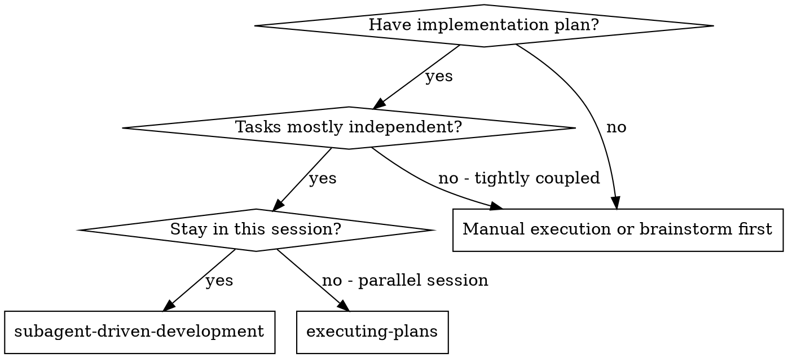
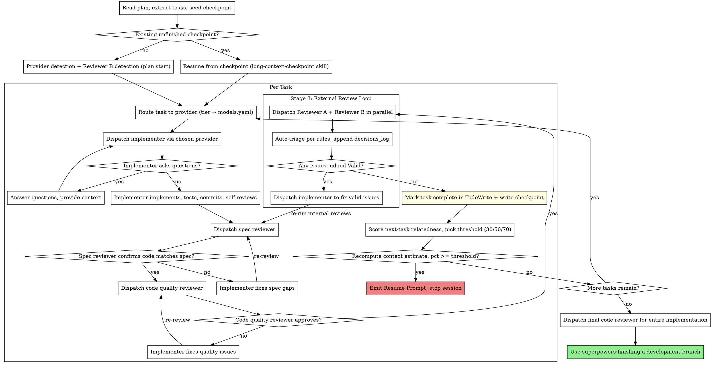

# Subagent-Driven Development

Execute plan by dispatching fresh subagent per task, with three-stage review after each: spec compliance review, expanded code quality review (performance, consistency, design), then cross-model external review (Reviewer A + Reviewer B in parallel).

**Why subagents:** You delegate tasks to specialized agents with isolated context. By precisely crafting their instructions and context, you ensure they stay focused and succeed at their task. They should never inherit your session's context or history — you construct exactly what they need. This also preserves your own context for coordination work.

**Core principle:** Fresh subagent per task + three-stage review (spec → quality → external cross-model) = high quality, fast iteration

## When to Use



**vs. Executing Plans (parallel session):**
- Same session (no context switch)
- Fresh subagent per task (no context pollution)
- Three-stage review after each task: spec compliance, code quality (expanded), external cross-model (Reviewer A + Reviewer B)
- Faster iteration (no human-in-loop between tasks)

## The Process



## Plan Start Initialization (one-time ask, first run only)

Before Reviewer B / provider detection, **on the very first run for a
plan** (no existing frontmatter with `plan_version` AND no existing
checkpoint), the controller asks the user a structured AskUserQuestion.
Skip entirely when:

- Plan.md already has `plan_version` in frontmatter — reuse it.
- `SUPERPOWERS_AUTONOMOUS_LOOP=1` is set — the outer script already chose.
- A valid checkpoint exists — resume path.

The human makes the choice **once**; every subsequent session reads the
frontmatter (or checkpoint) and does NOT re-ask.

### Question 1 — execution mode

> "Execution mode for this plan?"
> - **Interactive** (default): emit Resume Prompt at handoff; you resume manually.
> - **Autonomous**: `scripts/run-plan-autonomous.sh` drives iterations to completion.

### Question 2 — final_goal template (required)

> "What is the final goal for this plan, and how should it be verified?"

Seven templates plus `custom`:

| Template | User supplies | Verification |
|---|---|---|
| `all_tests_pass` | `verify_command` (e.g. `pytest -q`) | Run; exit 0 ⇒ met. |
| `code_review_clean` | — | Final code-reviewer must return no Critical/Important. |
| `verify_command_zero` | `verify_command` | Generic: run; exit 0 ⇒ met. |
| `deploy_success` | `deploy_command`, `health_check_command` | Both must exit 0. |
| `canary_clean` | `canary_command`, `canary_duration_sec` (default 300) | Command runs for duration; exit 0. |
| `metrics_met` | `metric_query_command`, `assertion` (shell expr) | `metric_query_command \| assertion` exits 0. |
| `custom` | `judge_rationale` (one sentence) | Goal Judge subagent (see `./goal-judge-prompt.md`). |

Record the chosen template and its params in plan frontmatter under
`final_goal:`. For programmatic templates (everything but `custom`) the
verification is a shell command; for `custom` it is a subagent dispatch.

### Question 3 — autonomous-only limits

Only when the user chose autonomous mode, ask:

> "Autonomous run limits (defaults in parens):"
> - `budget_pct` (30) — % of weekly cap from `~/.claude/superpowers-budget.yaml`. `none` for unlimited.
> - `max_convergence_rounds` (3) — times the convergence loop can append fresh tasks.
> - `max_handoffs` (10) — hard cap on session spawns.
> - `no_progress_abort_after` (2) — stop if N handoffs produce zero new `done` tasks.

Write all answers into plan frontmatter:

```yaml
---
plan_version: 1
final_goal:
  template: all_tests_pass
  verify_command: "pytest -q"
status: in_progress
execution_mode: autonomous
current_task: 1
convergence_round: 0
last_handoff: {pct: 0, ts: null}
checkpoint_pointer: docs/superpowers/checkpoints/<basename>-checkpoint.json
autonomous_limits:
  budget_pct: 30
  max_convergence_rounds: 3
  max_handoffs: 10
  no_progress_abort_after: 2
---
```

If the user chose Interactive, omit `autonomous_limits`.

## Checkpoint State Goes on Disk but NOT in Git

Checkpoints are per-machine, per-session execution state. They reference
absolute paths, session UUIDs, and timestamps. **They must not be committed.**

On the **first** checkpoint write in a new repo, the controller creates
`docs/superpowers/checkpoints/.gitignore` with:

```
# superpowers: checkpoints are runtime state, not source
*
!.gitignore
!README.md
```

And (if user hasn't created it already) `docs/superpowers/checkpoints/README.md`:

```markdown
# Checkpoints

Runtime state from `superpowers:long-context-checkpoint`. Not checked in.
Safe to delete once the corresponding plan is finished.
```

This puts checkpoints alongside `specs/` and `plans/` (which ARE in git) but
keeps the runtime artifacts out of commits.

## Checkpoint Integration

This skill is paired with [`superpowers:long-context-checkpoint`](../long-context-checkpoint/SKILL.md). The controller MUST:

1. **At plan start** — before Reviewer B detection, check for an unfinished checkpoint at `docs/superpowers/checkpoints/<plan-basename>-checkpoint.json`. If present with any task `status != "done"`, invoke `long-context-checkpoint` to resume (skip fresh provider/Reviewer B detection; reuse cached values).
2. **After Reviewer B + provider detection** — write the initial checkpoint with `provider_availability`, `reviewer_b_detected`, plan path, worktree, empty task list.
3. **After every task's `Mark task complete` step** — rewrite checkpoint with updated `tasks[].status`, `commit`, `triage_decisions`, and updated `todos`.
4. **After every auto-triage decision** — append one entry to `decisions_log` and rewrite.
5. **After every provider fallback event** — append one entry to `decisions_log` and rewrite.
6. **After every checkpoint write** — (a) recompute `last_context_estimate_pct` per the formula in `long-context-checkpoint` skill, (b) score the NEXT pending task's relatedness to the current session (high/medium/low) and pick the corresponding threshold (70/50/30), (c) if `pct >= threshold`, emit the Resume Prompt and stop. The relatedness rationale goes in the checkpoint for audit. See `long-context-checkpoint` skill → "Handoff Threshold (relatedness-aware)" for the full scoring rubric.

Never treat the checkpoint as optional. If the write fails (disk full, permissions), stop and surface the error — do not continue without durable state.

## Model Selection

Model routing is declarative. The mapping from **tier → ordered (provider, model) chain** lives in [`../../config/models.yaml`](../../config/models.yaml). The controller does NOT hardcode model names in dispatch code. The yaml is the source of truth; you edit it to add new models.

**Tier definitions** (what goes in a task's tier):
- **mechanical** — isolated functions, clear specs, 1-2 files. Optimize for cost/speed.
- **integration** — multi-file coordination, pattern matching, debugging. Needs judgment.
- **architecture** — design decisions, broad codebase understanding, reviews. Most capable model.

**Signals for auto-classification** (when a task card doesn't declare `**Tier:**` explicitly):
- Touches 1-2 files with a complete spec → **mechanical**
- Touches multiple files with integration concerns → **integration**
- Requires design judgment or broad codebase understanding → **architecture**

### Controller Flow at Plan Start

```
1. Bash scripts/detect-model-providers.sh → parse final JSON line
   → cache `provider_availability` in checkpoint (see long-context-checkpoint skill)
2. For each task:
   a. Read tier (from task card OR auto-classify by signals above)
   b. Walk models.yaml tiers[<tier>] top-to-bottom; pick first entry whose
      provider is `available: true`
   c. Dispatch via that provider (see next section for per-provider mechanics)
   d. If dispatch fails (non-zero exit, missing Status header, provider
      crash): fall to the next entry; log the fallback to
      checkpoint.decisions_log (see long-context-checkpoint skill)
```

The controller MUST print a one-line routing decision before dispatch, e.g.:

```
─── Task 2/5 routing ───
  Tier: mechanical → provider: anthropic, model: haiku
```

This makes it obvious in the transcript which model wrote which code.

## Implementer Provider Fallback

Different provider types are dispatched differently. Both surfaces must end in the same structured report (see `implementer-prompt.md` Output Protocol).

### `agent_tool` (Claude Code's built-in Agent tool)

```
Agent(
  subagent_type: "general-purpose",
  model: "<model from tier entry>",   # e.g. "haiku", "sonnet", "opus"
  description: "Implement Task N: <name>",
  prompt: <rendered implementer-prompt.md>
)
```

Parse the agent's final message for the `Status: ...` header.

### `cli_wrapper` (any CLI that accepts a prompt file and writes an output file)

```bash
# 1. Render the implementer prompt to a temp file
PROMPT_FILE=$(mktemp -t impl-XXXXX).md
OUTPUT_FILE=$(mktemp -t impl-XXXXX).out
STDERR_FILE=$(mktemp -t impl-XXXXX).err
cat > "$PROMPT_FILE" <<'EOF'
<rendered implementer-prompt.md>
EOF

# 2. Expand provider.command template with {model}, {prompt_file}, {output_file}
CMD="$(echo "$TEMPLATE" | sed \
  -e "s|{model}|$MODEL|g" \
  -e "s|{prompt_file}|$PROMPT_FILE|g" \
  -e "s|{output_file}|$OUTPUT_FILE|g")"

# 3. Run. CAPTURE STDERR separately — some CLIs (e.g. codex when it hits a
#    usage limit) exit 0 but write the error to stderr and leave the output
#    file empty. We need the stderr text for decisions_log so we know WHY a
#    fallback happened, not just that it did.
bash -c "$CMD" 2> "$STDERR_FILE"
RC=$?

# 4. Validate ALL of:
#    (a) rc == 0
#    (b) output file exists and is non-empty
#    (c) output starts with "Status: DONE|DONE_WITH_CONCERNS|BLOCKED|NEEDS_CONTEXT"
if [[ $RC -ne 0 ]] \
   || [[ ! -s "$OUTPUT_FILE" ]] \
   || ! grep -q "^Status: \(DONE\|DONE_WITH_CONCERNS\|BLOCKED\|NEEDS_CONTEXT\)" "$OUTPUT_FILE"; then
  # Record fallback with the actual reason (rc + first line of stderr)
  REASON="rc=$RC"
  if [[ -s "$STDERR_FILE" ]]; then
    REASON="$REASON; stderr=$(head -c 200 "$STDERR_FILE")"
  fi
  echo "[routing] provider $PROVIDER failed ($REASON) — falling back"
  # → write decisions_log entry: stage=provider_fallback, event="$REASON"
fi
```

The controller reads `$OUTPUT_FILE` and treats it the same as an agent_tool
return. The `$STDERR_FILE` is not passed forward to the next stage — it's
only for the fallback reason recorded in `decisions_log`.

### Routing Failure Escalation

If every provider in a tier's chain fails, this is a **hard gate** — the controller MUST stop and surface the failures to the user. Do not silently downgrade the task; do not invent a different tier. Report which providers failed and why, and let the user decide (install a missing CLI, fix config, re-tier the task, abort).

## Handling Implementer Status

Implementer subagents report one of four statuses. Handle each appropriately:

**DONE:** Proceed to spec compliance review.

**DONE_WITH_CONCERNS:** The implementer completed the work but flagged doubts. Read the concerns before proceeding. If the concerns are about correctness or scope, address them before review. If they're observations (e.g., "this file is getting large"), note them and proceed to review.

**NEEDS_CONTEXT:** The implementer needs information that wasn't provided. Provide the missing context and re-dispatch.

**BLOCKED:** The implementer cannot complete the task. Assess the blocker:
1. If it's a context problem, provide more context and re-dispatch with the same model
2. If the task requires more reasoning, re-dispatch with a more capable model
3. If the task is too large, break it into smaller pieces
4. If the plan itself is wrong, escalate to the human

**Never** ignore an escalation or force the same model to retry without changes. If the implementer said it's stuck, something needs to change.

## Stage Progress Display

**You MUST output stage markers before each review stage.** This gives the user real-time visibility into where the process is.

**Format — output these exact markers (with task number and name filled in):**

```
══════════════════════════════════════════════════════════
 Task {N}/{TOTAL}: {task name}
══════════════════════════════════════════════════════════

─── Stage 1/3: Spec Compliance ───
  Dispatching spec reviewer...
  Result: ✅ Spec compliant

─── Stage 2/3: Code Quality ───
  Dispatching code quality reviewer...
  Result: ✅ Approved

─── Stage 3/3: External Review ───
  ├─ Reviewer A (Sonnet):    dispatching...
  ├─ Reviewer B ({detected}): dispatching...
  ├─ Reviewer A (Sonnet):    ✅ Approved
  └─ Reviewer B ({detected}): ✅ Approved

✅ Task {N}/{TOTAL} complete
```

**On failure, show the loop:**
```
─── Stage 1/3: Spec Compliance ───
  Dispatching spec reviewer...
  Result: ❌ Issues found (2 items)
  Dispatching implementer to fix...
  Re-dispatching spec reviewer...
  Result: ✅ Spec compliant
```

**Rules:**
- Output the stage marker BEFORE dispatching each subagent
- Update the result line AFTER the subagent returns
- Show loop iterations inline (don't restart the stage marker)
- Use `├─` for in-progress items, `└─` for the last item in a group

## Reviewer B Detection

At plan start (before Task 1 begins), detect the best available Reviewer B and cache the result for all tasks in this plan.

**Detection runs once at plan start. Output the detection results:**

```
─── Reviewer B detection ───
  /codex:review skill: checking...
```

**Four-level fallback chain:**

1. **`/codex:review` skill** (codex plugin installed): Invoke via Skill tool with `--wait --base {BASE_SHA}`. Async alternative: invoke without `--wait`, poll `/codex:status`, retrieve via `/codex:result`. True cross-family diversity (GPT model).
2. **Codex CLI** (codex installed, plugin not): `codex exec review --base {BASE_SHA} --commit {HEAD_SHA} --ephemeral -o "$(mktemp /tmp/reviewer-b-XXXXXX.txt)"`. Same GPT model via standalone CLI.
3. **Gemini CLI** (gemini installed, codex not): Write prompt to temp file, pipe via stdin: `gemini -m gemini-2.5-pro < "$PROMPT_FILE"`. Cross-family diversity via Gemini.
4. **Claude Opus Agent** (no external CLI): Agent tool with `model: "opus"` using `./external-reviewer-prompt.md`. Same-family fallback — still provides diversity via different capability tier.

**Detection output examples:**

When codex plugin found:
```
─── Reviewer B detection ───
  /codex:review skill: ✅ available (codex plugin)
  Using: /codex:review (GPT, cross-family)
```

When only codex CLI found:
```
─── Reviewer B detection ───
  /codex:review skill: not available
  codex CLI: ✅ found (v0.116.0)
  Using: codex exec review (GPT, cross-family)
```

When nothing external found:
```
─── Reviewer B detection ───
  /codex:review skill: not available
  codex CLI: not found
  gemini CLI: not found
  ⚠ No external reviewer available — falling back to Claude Opus
  Using: Agent tool model: "opus" (same-family fallback)
```

## Prompt Templates

- `./implementer-prompt.md` - Dispatch implementer subagent
- `./spec-reviewer-prompt.md` - Dispatch spec compliance reviewer subagent
- `./code-quality-reviewer-prompt.md` - Dispatch code quality reviewer subagent (expanded: +performance, +consistency, +design)
- `./external-reviewer-prompt.md` - Dispatch external reviewers (Reviewer A + Reviewer B, cross-model review)

## Example Workflow

```
You: I'm using Subagent-Driven Development to execute this plan.

[Read plan file once: docs/superpowers/plans/feature-plan.md]
[Extract all 5 tasks with full text and context]
[Create TodoWrite with all tasks]

─── Reviewer B detection ───
  /codex:review skill: ✅ available (codex plugin)
  Using: /codex:review (GPT, cross-family)

══════════════════════════════════════════════════════════
 Task 1/5: Hook installation script
══════════════════════════════════════════════════════════

[Dispatch implementation subagent with full task text + context]

Implementer: "Before I begin - should the hook be installed at user or system level?"
You: "User level (~/.config/superpowers/hooks/)"

Implementer:
  - Implemented install-hook command
  - Added tests, 5/5 passing
  - Self-review: Found I missed --force flag, added it
  - Committed

─── Stage 1/3: Spec Compliance ───
  Dispatching spec reviewer...
  Result: ✅ Spec compliant — all requirements met, nothing extra

─── Stage 2/3: Code Quality ───
  Dispatching code quality reviewer...
  Result: ✅ Approved — good test coverage, clean

─── Stage 3/3: External Review ───
  ├─ Reviewer A (Sonnet):  dispatching via Agent tool...
  ├─ Reviewer B (Codex/GPT): dispatching via /codex:review --wait...
  ├─ Reviewer A (Sonnet):  ✅ Approved — no additional issues found
  └─ Reviewer B (Codex/GPT): ✅ Approved — no issues found

✅ Task 1 complete

══════════════════════════════════════════════════════════
 Task 2/5: Recovery modes
══════════════════════════════════════════════════════════

[Dispatch implementation subagent with full task text + context]

Implementer:
  - Added verify/repair modes
  - 8/8 tests passing
  - Self-review: All good
  - Committed

─── Stage 1/3: Spec Compliance ───
  Dispatching spec reviewer...
  Result: ❌ Issues found (2 items)
    - Missing: Progress reporting (spec says "report every 100 items")
    - Extra: Added --json flag (not requested)
  Dispatching implementer to fix...
  Re-dispatching spec reviewer...
  Result: ✅ Spec compliant

─── Stage 2/3: Code Quality ───
  Dispatching code quality reviewer...
  Result: ❌ Issues found (1 item)
    - Important: Magic number (100) should be a named constant
  Dispatching implementer to fix...
  Re-dispatching code quality reviewer...
  Result: ✅ Approved

─── Stage 3/3: External Review ───
  ├─ Reviewer A (Sonnet):  dispatching via Agent tool...
  ├─ Reviewer B (Codex/GPT): dispatching via /codex:review --wait...
  ├─ Reviewer A (Sonnet):  ⚠ 1 Minor issue
  │    Minor: Consider extracting progress utility
  └─ Reviewer B (Codex/GPT): ✅ Approved — no issues found

─── Auto-triaging external review feedback ───
  Reviewer A (Sonnet): 1 issue
    1. [Minor] Extract progress utility → ❌ Rejected (YAGNI — used once in this module)
  Decisions: 0 valid, 1 rejected, 0 deferred. Logged to checkpoint.decisions_log.

✅ Task 2 complete (checkpoint written; context estimate 18%)

...

[After all tasks]
[Dispatch final code-reviewer]
Final reviewer: All requirements met, ready to merge

Done!
```

## External Review Loop

After internal reviews (spec compliance + code quality) pass, the controller dispatches two external reviewers **in parallel**:

**Reviewer A (always Claude Sonnet):** Dispatched via Agent tool with `model: "sonnet"`. Uses `./external-reviewer-prompt.md` template. Focuses on blind spots, cross-task consistency, systemic/evolutionary concerns, and security.

**Reviewer B (best available — see "Reviewer B Detection"):** Dispatched via the detected mechanism (codex skill, codex CLI, gemini CLI, or opus agent). The detection result is cached from plan start.

**Parallel execution:** Reviewer A (Agent tool) and Reviewer B (Skill/Bash/Agent tool) dispatch in the same message for concurrent execution.

### Autonomous Feedback Triage

External reviewer feedback is **not automatically trusted**, but it is also
**not user-gated**. The controller triages every issue by the rules below,
logs every decision to `checkpoint.decisions_log` (append-only), and moves
on. The user audits the log after the fact; they are not interrupted in the
middle.

This is a deliberate design choice for long-running plans: real-time
confirmation turns every task into a 5-minute dialogue. The decision
log preserves the same information with zero interruption cost and a
better paper trail.

**Decision matrix:**

| Reviewer finding | Auto-decision |
|---|---|
| `Critical` or `Important` + touches security / correctness / data loss | **Valid** → dispatch implementer to fix |
| `Critical` or `Important` + controller cannot determine validity (reviewer citing code it can't reconcile with) | **Deferred** → add to `open_questions`, task completes with ⚠ note |
| `Minor` / `Style` + conflicts with a visible project convention | **Rejected** → log conflict + rationale |
| `Minor` / `Style` + no conflict, small fix | **Valid** → dispatch fix |
| `Minor` / `Style` + no conflict, would require ≥ 30 lines to "fix" | **Rejected** (YAGNI) |
| Reviewer cites wrong assumption / misread API / wrong file | **Rejected** → log the misread |
| Pure design trade-off with no clearly-better answer | **Deferred** → `open_questions`, continue |

**`decisions_log` entry format** (one per reviewer finding):

```json
{
  "ts":        "2026-04-13T14:22:10Z",
  "task":      2,
  "stage":     "external_review_triage",
  "reviewer":  "sonnet",
  "issue":     "Minor: extract progress utility",
  "decision":  "rejected",
  "rationale": "YAGNI — progress printer is used once; extraction would add an indirection with no callers"
}
```

**After triage:**
1. Controller prints one-line summary: `Decisions: N valid, M rejected, K deferred. Full log: <checkpoint>.decisions_log`
2. Controller writes checkpoint (decisions_log appended, open_questions updated).
3. If any `valid` → dispatch implementer subagent to fix those only, re-run internal reviews (Stage 1+2), then re-run Stage 3.
4. If zero `valid` → mark task complete, recompute context estimate, proceed.

**Exit condition:** No issues remain in `valid` state (either all fixed and re-approved, or all rejected/deferred).

### When to Escalate to the User (hard gates)

The controller asks the user ONLY in these cases:

- **Operation on `main`/`master`** — always ask before merging, pushing, or rebasing.
- **Implementer reports BLOCKED and all providers in the tier chain have been exhausted** — no fallback remains.
- **Every external reviewer finding is deferred** (zero valid, zero rejected, all ambiguous) AND the task appears stuck — surface `open_questions` and ask for a direction.
- **Reviewer A and Reviewer B actively contradict** on a `Critical` finding (one says "must fix", other says "must not fix") — truly ambiguous; user decides.

Everything else: decide, log, proceed.

### External Review Example

```
─── Stage 3/3: External Review ───
  ├─ Reviewer A (Sonnet):  dispatching via Agent tool...
  ├─ Reviewer B (Codex/GPT): dispatching via /codex:review --wait --base abc123...
  ├─ Reviewer A (Sonnet):  ❌ Needs Fix (1 Important)
  │    Important: Race condition in concurrent access to shared cache (utils.ts:45)
  └─ Reviewer B (Codex/GPT): ✅ Approved

─── Auto-triaging external review feedback ───
  Reviewer A (Sonnet): 1 issue
    1. [Important] Race condition in cache access → ✅ Valid (correctness issue; dispatching fix)
  Reviewer B (Codex/GPT): 0 issues
  Decisions: 1 valid, 0 rejected, 0 deferred. Logged to checkpoint.decisions_log.

  Dispatching implementer to fix...

  Re-running internal reviews on fix:
─── Stage 1/3: Spec Compliance (re-review) ───
  Result: ✅ Spec compliant
─── Stage 2/3: Code Quality (re-review) ───
  Result: ✅ Approved

─── Stage 3/3: External Review (round 2) ───
  ├─ Reviewer A (Sonnet):  ✅ Approved — race condition properly addressed
  └─ Reviewer B (Codex/GPT): ✅ Approved

✅ Task 2 complete
```

## Advantages

**vs. Manual execution:**
- Subagents follow TDD naturally
- Fresh context per task (no confusion)
- Parallel-safe (subagents don't interfere)
- Subagent can ask questions (before AND during work)

**vs. Executing Plans:**
- Same session (no handoff)
- Continuous progress (no waiting)
- Review checkpoints automatic

**Efficiency gains:**
- No file reading overhead (controller provides full text)
- Controller curates exactly what context is needed
- Subagent gets complete information upfront
- Questions surfaced before work begins (not after)

**Quality gates:**
- Self-review catches issues before handoff
- Three-stage review: spec compliance, code quality (expanded), external cross-model
- Review loops ensure fixes actually work at each stage
- Spec compliance prevents over/under-building
- Code quality ensures implementation is well-built, performant, consistent, well-designed
- External cross-model review catches blind spots that same-model review misses

**Cost:**
- More subagent invocations (implementer + 2 internal reviewers + 2 external reviewers per task)
- External review loop adds Sonnet API cost + Codex/Opus API cost per task
- Controller does more prep work (extracting all tasks upfront, merging external feedback)
- Review loops add iterations at each stage
- But catches issues early (cheaper than debugging later)
- Cross-model review is the most expensive stage — justified by catching blind spots

## Red Flags

**Never:**
- Start implementation on main/master branch without explicit user consent
- Skip reviews (spec compliance OR code quality)
- Proceed with unfixed issues
- Dispatch multiple implementation subagents in parallel (conflicts)
- Make subagent read plan file (provide full text instead)
- Skip scene-setting context (subagent needs to understand where task fits)
- Ignore subagent questions (answer before letting them proceed)
- Accept "close enough" on spec compliance (spec reviewer found issues = not done)
- Skip review loops (reviewer found issues = implementer fixes = review again)
- Let implementer self-review replace actual review (both are needed)
- **Start code quality review before spec compliance is ✅** (wrong order)
- Move to next task while any review stage has open issues
- **Skip external review after internal reviews pass** (all three stages are mandatory)
- **Start external review before code quality review is ✅** (wrong order: spec → quality → external)
- **Proceed when only one external reviewer approves** (both external reviewers must approve, or user confirms triage rejections)
- **Send unfixed internal review issues to external review** (fix internal issues first)
- **Skip Reviewer B detection** (run it once at plan start, cache the result)
- **Omit stage markers** (user must see which stage is active at all times)
- **Blindly accept external review feedback** (auto-triage each issue by the rules in Autonomous Feedback Triage — external models may misunderstand project conventions)
- **Skip logging triage decisions** (every decision must land in `checkpoint.decisions_log` — that log IS the user's audit path, so if you skip logging you have effectively hidden the decision)
- **Interrupt the user mid-task to confirm a triage** (default is autonomous; only escalate on the four hard gates listed in "When to Escalate to the User")
- **Skip writing the checkpoint after a task completes** (the checkpoint is the only durable state; subagents are fresh per task, so if you don't write, it's gone)

**If subagent asks questions:**
- Answer clearly and completely
- Provide additional context if needed
- Don't rush them into implementation

**If reviewer finds issues:**
- Implementer (same subagent) fixes them
- Reviewer reviews again
- Repeat until approved
- Don't skip the re-review

**If subagent fails task:**
- Dispatch fix subagent with specific instructions
- Don't try to fix manually (context pollution)

**If external reviewers disagree:**
- If one approves and one finds issues, triage the issues first, then fix valid ones and re-submit to both
- If both find different issues, merge and dedup, triage all, fix valid ones, re-submit to both
- Never cherry-pick which reviewer's feedback to address — triage everything, fix what's valid
- If reviewer flags something that matches project conventions, reject with explanation
- When in doubt, present as "Discuss" and let the user decide

## Integration

**Required workflow skills:**
- **superpowers:using-git-worktrees** - REQUIRED: Set up isolated workspace before starting
- **superpowers:writing-plans** - Creates the plan this skill executes
- **superpowers:requesting-code-review** - Code review template for reviewer subagents
- **superpowers:finishing-a-development-branch** - Complete development after all tasks

**Subagents should use:**
- **superpowers:test-driven-development** - Subagents follow TDD for each task

**Alternative workflow:**
- **superpowers:executing-plans** - Use for parallel session instead of same-session execution
