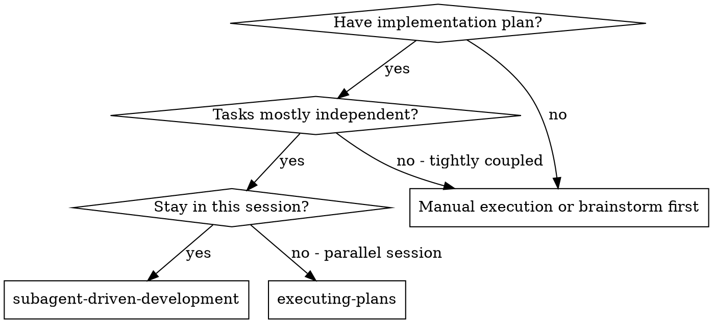
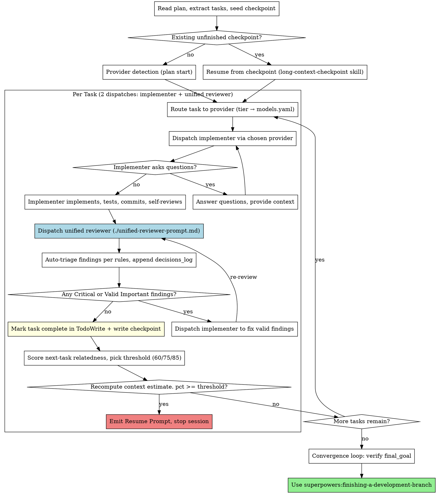

# Subagent-Driven Development

Execute plan by dispatching fresh subagent per task, with three-stage review after each: spec compliance review, expanded code quality review (performance, consistency, design), then cross-model external review (Reviewer A + Reviewer B in parallel).

**Why subagents:** You delegate tasks to specialized agents with isolated context. By precisely crafting their instructions and context, you ensure they stay focused and succeed at their task. They should never inherit your session's context or history — you construct exactly what they need. This also preserves your own context for coordination work.

**Core principle:** Fresh subagent per task + single unified review (spec / quality / coverage / architecture / performance / security in one structured output) = high quality at minimum dispatch cost.

**Per-task dispatches** (since 6.2.0): 1 implementer + 1 unified reviewer = 2. Was 5 in 6.1.0 and earlier (impl + spec-reviewer + quality-reviewer + external A + external B).

## When to Use



**vs. Executing Plans (parallel session):**
- Same session (no context switch)
- Fresh subagent per task (no context pollution)
- Three-stage review after each task: spec compliance, code quality (expanded), external cross-model (Reviewer A + Reviewer B)
- Faster iteration (no human-in-loop between tasks)

## The Process



**As of 6.2.0:** review is one dispatch (`./unified-reviewer-prompt.md`)
covering spec / quality / coverage / architecture / performance /
security in a single structured output. The earlier three-stage chain
(spec → quality → external A+B) is replaced. Per-task subagent
dispatches: 1 implementer + 1 reviewer = **2 per task** (was 5).

## Plan Start Initialization (one-time ask, first run only)

Before Reviewer B / provider detection, **on the very first run for a
plan** (no existing frontmatter with `plan_version` AND no existing
checkpoint), the controller asks the user a structured AskUserQuestion.
Skip entirely when:

- Plan.md already has `plan_version` in frontmatter — reuse it.
- `SUPERPOWERS_AUTONOMOUS_LOOP=1` is set — the outer script already chose.
- A valid checkpoint exists — resume path.

The human makes the choice **once**; every subsequent session reads the
frontmatter (or checkpoint) and does NOT re-ask.

### Question 1 — execution mode

> "Execution mode for this plan?"
> - **Interactive** (default): emit Resume Prompt at handoff; you resume manually.
> - **Autonomous**: `scripts/run-plan-autonomous.sh` drives iterations to completion.

### Question 2 — final_goal template (required)

> "What is the final goal for this plan, and how should it be verified?"

Seven templates plus `custom`:

| Template | User supplies | Verification |
|---|---|---|
| `all_tests_pass` | `verify_command` (e.g. `pytest -q`) | Run; exit 0 ⇒ met. |
| `code_review_clean` | — | Final code-reviewer must return no Critical/Important. |
| `verify_command_zero` | `verify_command` | Generic: run; exit 0 ⇒ met. |
| `deploy_success` | `deploy_command`, `health_check_command` | Both must exit 0. |
| `canary_clean` | `canary_command`, `canary_duration_sec` (default 300) | Command runs for duration; exit 0. |
| `metrics_met` | `metric_query_command`, `assertion` (shell expr) | `metric_query_command \| assertion` exits 0. |
| `custom` | `judge_rationale` (one sentence) | Goal Judge subagent (see `./goal-judge-prompt.md`). |

Record the chosen template and its params in plan frontmatter under
`final_goal:`. For programmatic templates (everything but `custom`) the
verification is a shell command; for `custom` it is a subagent dispatch.

### Question 3 — autonomous-only limits

Only when the user chose autonomous mode, ask:

> "Autonomous run limits (defaults in parens):"
> - `budget_pct` (30) — % of weekly cap from `~/.claude/superpowers-budget.yaml`. `none` for unlimited.
> - `max_convergence_rounds` (3) — times the convergence loop can append fresh tasks.
> - `max_handoffs` (10) — hard cap on session spawns.
> - `no_progress_abort_after` (2) — stop if N handoffs produce zero new `done` tasks.

### Question 4 — context-handoff policy (ask in both modes)

> "Allow automatic context-based handoffs during this plan?"
> - **Yes (default)**: at each task boundary, pause and hand off when context pct crosses the relatedness threshold (60/75/85 for low/medium/high). Safer for long plans; state is persisted so a crashed session recovers cleanly.
> - **No, run to completion**: skip context handoffs entirely. The controller keeps running and relies on Claude Code's `/compact` to shed history if pressure grows. Best for short plans, or when you want unbroken flow and accept that a genuinely full context will degrade via auto-compact instead of cleanly handing off.

The choice is plan-scoped and persists across resumes. Hard gates
(main-branch ops, BLOCKED with all providers exhausted, convergence
stalemate) are independent of this switch and still stop the session.

Write all answers into plan frontmatter:

```yaml
---
plan_version: 1
final_goal:
  template: all_tests_pass
  verify_command: "pytest -q"
status: in_progress
execution_mode: autonomous
current_task: 1
convergence_round: 0
last_handoff: {pct: 0, ts: null}
checkpoint_pointer: docs/superpowers/checkpoints/<basename>-checkpoint.json
handoff_disabled: false
autonomous_limits:
  budget_pct: 30
  max_convergence_rounds: 3
  max_handoffs: 10
  no_progress_abort_after: 2
---
```

`handoff_disabled` is optional; absent means `false`. Env override
`SUPERPOWERS_HANDOFF_DISABLED=1` wins over the frontmatter value for a
single run.

If the user chose Interactive, omit `autonomous_limits`.

## Checkpoint State Goes on Disk but NOT in Git

Checkpoints are per-machine, per-session execution state. They reference
absolute paths, session UUIDs, and timestamps. **They must not be committed.**

On the **first** checkpoint write in a new repo, the controller creates
`docs/superpowers/checkpoints/.gitignore` with:

```
# superpowers: checkpoints are runtime state, not source
*
!.gitignore
!README.md
```

And (if user hasn't created it already) `docs/superpowers/checkpoints/README.md`:

```markdown
# Checkpoints

Runtime state from `superpowers:long-context-checkpoint`. Not checked in.
Safe to delete once the corresponding plan is finished.
```

This puts checkpoints alongside `specs/` and `plans/` (which ARE in git) but
keeps the runtime artifacts out of commits.

## Checkpoint Integration

This skill is paired with [`superpowers:long-context-checkpoint`](../long-context-checkpoint/SKILL.md). The controller MUST:

1. **At plan start** — before Reviewer B detection, check for an unfinished checkpoint at `docs/superpowers/checkpoints/<plan-basename>-checkpoint.json`. If present with any task `status != "done"`, invoke `long-context-checkpoint` to resume (skip fresh provider/Reviewer B detection; reuse cached values).
2. **After Reviewer B + provider detection** — write the initial checkpoint with `provider_availability`, `reviewer_b_detected`, plan path, worktree, empty task list.
3. **After every task's `Mark task complete` step** — rewrite checkpoint with updated `tasks[].status`, `commit`, `triage_decisions`, and updated `todos`.
4. **After every auto-triage decision** — append one entry to `decisions_log` and rewrite.
5. **After every provider fallback event** — append one entry to `decisions_log` and rewrite.
6. **After every checkpoint write** — (a) recompute `last_context_estimate_pct` per the formula in `long-context-checkpoint` skill, (b) score the NEXT pending task's relatedness to the current session (high/medium/low) and pick the corresponding threshold (85/75/60), (c) if `$SUPERPOWERS_HANDOFF_DISABLED=1` OR plan frontmatter has `handoff_disabled: true`, skip the handoff check (still print a warning above threshold so the user sees pressure); otherwise if `pct >= threshold`, emit the Resume Prompt and stop. The relatedness rationale goes in the checkpoint for audit. See `long-context-checkpoint` skill → "Handoff Threshold (relatedness-aware)" for the full scoring rubric.

Never treat the checkpoint as optional. If the write fails (disk full, permissions), stop and surface the error — do not continue without durable state.

### Dual-write protocol (plan.md + checkpoint.json)

Execution state lives in two files; every state transition touches BOTH.

**On each task's final approval** (all 3 review stages ✅):

1. **Write checkpoint.json** (authoritative, structured). Update
   `tasks[n]` with `status: done`, `commit`, `provider_used`,
   `triage_decisions`; append to `decisions_log`; update `todos`.
2. **Edit plan.md** (human-readable view):
   - Under `## Task N`, change `**Status:** in_progress` →
     `**Status:** done` (or add the line if missing).
   - Append `**Commit:** <sha>` and `**Provider:** <provider>/<model>`
     underneath the Status line if not already present.
   - In frontmatter, set `current_task: N+1` and
     `last_handoff: {pct: <estimate>, ts: <ISO>}`.

**On BLOCKED** (all providers in tier chain exhausted):

1. checkpoint.json records the blocker detail.
2. plan.md `## Task N`: `**Status:** blocked` + `**Blocker:** <short reason>`.
3. Autonomous mode additionally writes `NEEDS_HUMAN.txt` and exits.

**Atomicity:** checkpoint first, then plan.md. If the plan.md edit fails
(permissions, unexpected content), the checkpoint still has authoritative
state; on next resume, rebuild plan.md frontmatter from the checkpoint's
`tasks` array.

**Never** edit plan.md's human-authored body (the task spec, the prose
intro, the success criteria) — only the frontmatter scalar fields and the
per-task `**Status:**` / `**Commit:**` / `**Provider:**` / `**Blocker:**`
metadata lines.

## Model Selection

Model routing is declarative. The mapping from **tier → ordered (provider, model) chain** lives in [`../../config/models.yaml`](../../config/models.yaml). The controller does NOT hardcode model names in dispatch code. The yaml is the source of truth; you edit it to add new models.

**Tier definitions** (what goes in a task's tier):
- **mechanical** — isolated functions, clear specs, 1-2 files. Optimize for cost/speed.
- **integration** — multi-file coordination, pattern matching, debugging. Needs judgment.
- **architecture** — design decisions, broad codebase understanding, reviews. Most capable model.

**Signals for auto-classification** (when a task card doesn't declare `**Tier:**` explicitly):
- Touches 1-2 files with a complete spec → **mechanical**
- Touches multiple files with integration concerns → **integration**
- Requires design judgment or broad codebase understanding → **architecture**

### Controller Flow at Plan Start

```
1. Bash scripts/detect-model-providers.sh → parse final JSON line
   → cache `provider_availability` in checkpoint (see long-context-checkpoint skill)
2. For each task:
   a. Read tier (from task card OR auto-classify by signals above)
   b. Walk models.yaml tiers[<tier>] top-to-bottom; pick first entry whose
      provider is `available: true`
   c. Dispatch via that provider (see next section for per-provider mechanics)
   d. If dispatch fails (non-zero exit, missing Status header, provider
      crash): fall to the next entry; log the fallback to
      checkpoint.decisions_log (see long-context-checkpoint skill)
```

The controller MUST print a one-line routing decision before dispatch, e.g.:

```
─── Task 2/5 routing ───
  Tier: mechanical → provider: anthropic, model: haiku
```

This makes it obvious in the transcript which model wrote which code.

## Implementer Provider Fallback

Different provider types are dispatched differently. Both surfaces must end in the same structured report (see `implementer-prompt.md` Output Protocol).

### `agent_tool` (Claude Code's built-in Agent tool)

```
Agent(
  subagent_type: "general-purpose",
  model: "<model from tier entry>",   # e.g. "haiku", "sonnet", "opus"
  description: "Implement Task N: <name>",
  prompt: <rendered implementer-prompt.md>
)
```

Parse the agent's final message for the `Status: ...` header.

### `cli_wrapper` (any CLI that accepts a prompt file and writes an output file)

```bash
# 1. Render the implementer prompt to a temp file
PROMPT_FILE=$(mktemp -t impl-XXXXX).md
OUTPUT_FILE=$(mktemp -t impl-XXXXX).out
STDERR_FILE=$(mktemp -t impl-XXXXX).err
cat > "$PROMPT_FILE" <<'EOF'
<rendered implementer-prompt.md>
EOF

# 2. Expand provider.command template with {model}, {prompt_file}, {output_file}
CMD="$(echo "$TEMPLATE" | sed \
  -e "s|{model}|$MODEL|g" \
  -e "s|{prompt_file}|$PROMPT_FILE|g" \
  -e "s|{output_file}|$OUTPUT_FILE|g")"

# 3. Run. CAPTURE STDERR separately — some CLIs (e.g. codex when it hits a
#    usage limit) exit 0 but write the error to stderr and leave the output
#    file empty. We need the stderr text for decisions_log so we know WHY a
#    fallback happened, not just that it did.
bash -c "$CMD" 2> "$STDERR_FILE"
RC=$?

# 4. Validate ALL of:
#    (a) rc == 0
#    (b) output file exists and is non-empty
#    (c) output starts with "Status: DONE|DONE_WITH_CONCERNS|BLOCKED|NEEDS_CONTEXT"
if [[ $RC -ne 0 ]] \
   || [[ ! -s "$OUTPUT_FILE" ]] \
   || ! grep -q "^Status: \(DONE\|DONE_WITH_CONCERNS\|BLOCKED\|NEEDS_CONTEXT\)" "$OUTPUT_FILE"; then
  # Record fallback with the actual reason (rc + first line of stderr)
  REASON="rc=$RC"
  if [[ -s "$STDERR_FILE" ]]; then
    REASON="$REASON; stderr=$(head -c 200 "$STDERR_FILE")"
  fi
  echo "[routing] provider $PROVIDER failed ($REASON) — falling back"
  # → write decisions_log entry: stage=provider_fallback, event="$REASON"
fi
```

The controller reads `$OUTPUT_FILE` and treats it the same as an agent_tool
return. The `$STDERR_FILE` is not passed forward to the next stage — it's
only for the fallback reason recorded in `decisions_log`.

### Routing Failure Escalation

If every provider in a tier's chain fails, this is a **hard gate** — the controller MUST stop and surface the failures to the user. Do not silently downgrade the task; do not invent a different tier. Report which providers failed and why, and let the user decide (install a missing CLI, fix config, re-tier the task, abort).

## Handling Implementer Status

Implementer subagents report one of four statuses. Handle each appropriately:

**DONE:** Proceed to spec compliance review.

**DONE_WITH_CONCERNS:** The implementer completed the work but flagged doubts. Read the concerns before proceeding. If the concerns are about correctness or scope, address them before review. If they're observations (e.g., "this file is getting large"), note them and proceed to review.

**NEEDS_CONTEXT:** The implementer needs information that wasn't provided. Provide the missing context and re-dispatch.

**BLOCKED:** The implementer cannot complete the task. Assess the blocker:
1. If it's a context problem, provide more context and re-dispatch with the same model
2. If the task requires more reasoning, re-dispatch with a more capable model
3. If the task is too large, break it into smaller pieces
4. If the plan itself is wrong, escalate to the human

**Never** ignore an escalation or force the same model to retry without changes. If the implementer said it's stuck, something needs to change.

## Stage Progress Display

**You MUST output a marker before dispatching each subagent.** This gives
the user real-time visibility.

**Format — output these exact markers (with task number and name filled in):**

```
══════════════════════════════════════════════════════════
 Task {N}/{TOTAL}: {task name}
══════════════════════════════════════════════════════════

─── Implementer ({provider}/{model}) ───
  Dispatching...
  Result: ✅ DONE

─── Unified Reviewer ({provider}/{model}) ───
  Dispatching...
  Result: ✅ APPROVED
  Findings: 0 critical, 0 important, 0 minor

✅ Task {N}/{TOTAL} complete
```

**On findings → fix → re-review:**
```
─── Unified Reviewer (anthropic/sonnet) ───
  Dispatching...
  Result: ⚠ NEEDS_FIX
  Findings: 0 critical, 2 important, 1 minor
  Auto-triage: 2 valid (important), 1 rejected (minor: matches convention)
  Dispatching implementer to fix...
  Re-dispatching unified reviewer...
  Result: ✅ APPROVED
```

**Rules:**
- Output the marker BEFORE dispatching each subagent.
- Update the result line AFTER the subagent returns.
- Show loop iterations inline (don't restart the task marker).

## Prompt Templates

- `./implementer-prompt.md` — Dispatch implementer subagent
- `./unified-reviewer-prompt.md` — Single-dispatch reviewer covering
  spec / quality / coverage / architecture / performance / security
- `./goal-judge-prompt.md` — Goal Judge subagent (custom final_goal template only)
- `./gap-analyzer-prompt.md` — Gap Analyzer subagent (convergence loop)

## Example Workflow

```
You: I'm using Subagent-Driven Development to execute this plan.

[Read plan file once: docs/superpowers/plans/feature-plan.md]
[Extract all 5 tasks with full text and context]
[Create TodoWrite with all tasks]

─── Provider detection ───
  anthropic (agent_tool): ✅
  codex (cli_wrapper): ✅
  gemini-cli (cli_wrapper): ✅
  glm-cli (cli_wrapper): ❌ not on PATH

══════════════════════════════════════════════════════════
 Task 1/5: Hook installation script
══════════════════════════════════════════════════════════

─── Implementer (anthropic/sonnet) ───
  Dispatching...
  Implementer: "Before I begin — user or system level?"
  You: "User level"
  Result: ✅ DONE
    - install-hook implemented, 5/5 tests passing
    - Self-review found missing --force flag, added

─── Unified Reviewer (codex/gpt-5.4) ───
  (cross-family routing: implementer was Anthropic → reviewer is Codex)
  Dispatching...
  Result: ✅ APPROVED (0 critical, 0 important, 0 minor)

✅ Task 1 complete

══════════════════════════════════════════════════════════
 Task 2/5: Recovery modes
══════════════════════════════════════════════════════════

─── Implementer (anthropic/sonnet) ───
  Result: ✅ DONE — verify/repair modes, 8/8 tests passing

─── Unified Reviewer (codex/gpt-5.4) ───
  Result: ⚠ NEEDS_FIX
    Critical: (none)
    Important: 1
      - Spec gap: missing progress reporting (spec: "report every 100 items")
      - Quality: magic number 100 should be named constant
    Minor: 1
      - Style: consider extracting progress utility (Coverage dim)
  Auto-triage:
    - 2 Important → Valid (spec gap + named-constant rule)
    - 1 Minor → Rejected (YAGNI: utility used once)
  Decisions: 2 valid, 1 rejected, 0 deferred. Logged.

─── Implementer (anthropic/sonnet) — fix pass ───
  Result: ✅ DONE — added progress callback, extracted REPORT_INTERVAL

─── Unified Reviewer (codex/gpt-5.4) ───
  Result: ✅ APPROVED

✅ Task 2 complete (checkpoint written; context estimate 18%)

...

[After all tasks → convergence loop runs final_goal verification]
[If all met, frontmatter.status = goal_met; terminate.]

Done!
```

## Unified Review Stage

After the implementer reports `Status: DONE`, the controller dispatches
**one** subagent (`./unified-reviewer-prompt.md`) that covers all six
review dimensions in a single structured output: spec compliance, code
quality, test coverage depth, architecture, performance, security.

**Cross-model diversity** is preserved by routing the reviewer to a
**different family than the implementer when possible** (see "Model
Selection" below — `reviewer` tier prefers a non-Anthropic provider when
the implementer ran on Anthropic, and vice versa).

### Autonomous Feedback Triage

Reviewer findings are **not automatically trusted**, but they are also
**not user-gated**. The controller triages every finding by the rules
below, logs every decision to `checkpoint.decisions_log` (append-only),
and moves on. The user audits the log after the fact; they are not
interrupted in the middle.

This is a deliberate design choice for long-running plans: real-time
confirmation turns every task into a 5-minute dialogue. The decision
log preserves the same information with zero interruption cost and a
better paper trail.

**Decision matrix:**

| Reviewer finding | Auto-decision |
|---|---|
| `Critical` (any) | **Valid** → dispatch implementer to fix |
| `Important` + touches security / correctness / data loss | **Valid** → fix |
| `Important` + controller cannot determine validity (reviewer citing code it can't reconcile with) | **Deferred** → add to `open_questions`, task completes with ⚠ note |
| `Minor` + conflicts with a visible project convention | **Rejected** → log conflict + rationale |
| `Minor` + no conflict, small fix (< 30 lines) | **Valid** → dispatch fix |
| `Minor` + no conflict, > 30 lines to "fix" | **Rejected** (YAGNI) |
| Reviewer cites wrong assumption / misread API / wrong file | **Rejected** → log the misread |
| Pure design trade-off with no clearly-better answer | **Deferred** → `open_questions`, continue |

**`decisions_log` entry format** (one per reviewer finding):

```json
{
  "ts":        "2026-04-13T14:22:10Z",
  "task":      2,
  "stage":     "review_triage",
  "reviewer":  "anthropic/sonnet",
  "dimension": "Quality",
  "severity":  "Important",
  "issue":     "magic number 100 should be a named constant (utils.ts:45)",
  "decision":  "valid",
  "rationale": "matches naming convention rule, < 5 lines"
}
```

**After triage:**
1. Controller prints one-line summary:
   `Decisions: N valid, M rejected, K deferred. Full log: <checkpoint>.decisions_log`
2. Controller writes checkpoint (decisions_log appended,
   open_questions updated).
3. If any `valid` → dispatch implementer subagent to fix those only;
   re-run unified reviewer.
4. If zero `valid` → mark task complete; recompute context estimate;
   proceed.

**Exit condition:** Reviewer returns `Status: APPROVED` OR all remaining
findings are rejected/deferred (with audit trail).

## Convergence Loop

Triggered when **all** tasks reach a terminal state (`done`, `deferred`,
or `superseded`) — `blocked` is NOT terminal; a blocked task is its own
hard gate (see below).

```
CONVERGENCE_LOOP:
  # Step 1 — verify final_goal
  case plan.final_goal.template:
    programmatic ({all_tests_pass, verify_command_zero, deploy_success,
                  canary_clean, metrics_met}):
      run the appropriate command(s); capture exit + stdout+stderr tail.
    code_review_clean:
      reuse the final code-reviewer's output already recorded in
      decisions_log; verdict = no Critical/Important ⇒ met.
    custom:
      dispatch Goal Judge subagent (./goal-judge-prompt.md).

  append decisions_log entry: stage=final_goal_verification,
    outcome={met|not_met|uncertain}, evidence=<tail>

  # Step 2 — act on verdict
  if met:
    frontmatter.status = goal_met; terminate 0.
  if uncertain:   # only custom template can produce this
    write NEEDS_HUMAN.txt; frontmatter.status = judge_uncertain;
    terminate 2.
  # else: not_met

  # Step 3 — convergence bounds
  convergence_round += 1
  if convergence_round > max_convergence_rounds:
    frontmatter.status = goal_not_met; write conclusion to decisions_log
    (include last verify output + suggested next step); terminate 1.
  if budget check would fail for even one more task:
    frontmatter.status = budget_exhausted; terminate 1.

  # Step 4 — gap analysis
  dispatch Gap Analyzer subagent (./gap-analyzer-prompt.md)
    inputs: final_goal, last verify output, full plan.md,
            last 20 decisions_log entries
  parse output:
    Verdict: actionable | unreachable
    TaskCount: N
    tasks: [{name, tier, rationale, spec}, ...]
  if Verdict == unreachable:
    write NEEDS_HUMAN.txt; frontmatter.status = goal_not_met;
    include analyzer rationale; terminate 2.

  # Step 5 — append tasks
  for each new task:
    append `## Task X: <name>` to plan.md with
      **Tier:** <tier>
      **Status:** pending
      **Rationale:** <analyzer rationale>
      <spec body>
  frontmatter.current_task = first new task number
  no_progress_count = 0    # convergence counts as progress

  # Step 6 — re-enter main subagent-driven-development loop
  dispatch implementer for the new current_task; three-stage review;
  eventually re-enter CONVERGENCE_LOOP.
```

**Why gap analyzer is a subagent, not the controller itself:** the
controller's context is full of review history from the prior tasks; a
fresh subagent sees the situation cleanly and is less likely to propose
tasks that rehash already-rejected triage decisions.

**Why `no_progress_count` resets on convergence:** the stall guard is to
catch "dispatched tasks but none completed" — convergence-added tasks
are legitimate new progress, not a stall.

### Hard-gate termination matrix

| Trigger | `frontmatter.status` | exit | Outputs |
|---|---|---|---|
| final_goal met | `goal_met` | 0 | Summary line + final verify output |
| Convergence rounds exhausted, not_met | `goal_not_met` | 1 | Last-round gap analyzer rationale |
| Weekly budget (pct or cap) exceeded | `budget_exhausted` | 1 | Spend summary |
| No-progress abort | `stalled` | 1 | Last `done` timestamp, counters |
| Task BLOCKED with providers exhausted | `blocked` | 2 | NEEDS_HUMAN.txt with blocker |
| Goal Judge returns `uncertain` | `judge_uncertain` | 2 | NEEDS_HUMAN.txt with judge output |
| Reviewer A/B contradict on Critical | `review_contradiction` | 2 | NEEDS_HUMAN.txt with both reviewer outputs |
| main/master operation proposed | `main_branch_gate` | 2 | NEEDS_HUMAN.txt with proposed action |

Interactive mode: all `exit 2` (NEEDS_HUMAN) cases ask the user via
AskUserQuestion instead of writing the file. All `exit 1` cases still emit
a summary to stdout. `exit 0` is the success path.

Autonomous mode: all `exit 2` cases write `NEEDS_HUMAN.txt` and the outer
`run-plan-autonomous.sh` stops the loop. The user inspects the file and
decides whether to resume.

## Advantages

**vs. Manual execution:**
- Subagents follow TDD naturally
- Fresh context per task (no confusion)
- Parallel-safe (subagents don't interfere across tasks)
- Subagent can ask questions (before AND during work)

**vs. Executing Plans:**
- Same session (no handoff between tasks)
- Continuous progress (no waiting)
- Review checkpoints automatic

**Efficiency gains:**
- No file reading overhead (controller provides full text)
- Controller curates exactly what context is needed
- Subagent gets complete information upfront
- Questions surfaced before work begins (not after)

**Quality gates:**
- Self-review catches issues before handoff
- **Single unified review** (since 6.2.0) covering 6 dimensions
  (spec / quality / coverage / architecture / performance / security)
- Cross-model diversity preserved via reviewer-tier provider routing
  (reviewer prefers a different family from implementer)
- Review loop ensures fixes actually work
- Severity-tagged findings + autonomous triage matrix

**Cost (since 6.2.0):**
- 2 subagent invocations per task (implementer + reviewer) — down from 5
- One review loop iteration on `NEEDS_FIX`
- ~60% reduction in subagent dispatches vs. the old three-stage chain
- Controller still does prep work (extracting all tasks upfront, building
  diff for reviewer)

## Red Flags

**Never:**
- Start implementation on main/master branch without explicit user consent
- Skip the unified review (every task gets one reviewer dispatch, no exceptions)
- Proceed with unfixed Critical or Valid Important findings
- Dispatch multiple implementation subagents in parallel (conflicts)
- Make subagent read plan file (provide full text instead)
- Skip scene-setting context (subagent needs to understand where task fits)
- Ignore subagent questions (answer before letting them proceed)
- Let implementer self-review replace the reviewer dispatch (both are needed)
- Move to next task while reviewer Status is `NEEDS_FIX` and any finding remains in Valid state
- **Re-introduce the old three-stage chain** (spec → quality → external A+B). 6.2.0 collapsed this into one dispatch on purpose; bringing back four reviewers undoes the cost win without adding signal.
- **Use the same provider family for implementer and reviewer** when a different family is available — diversity preserved by routing the reviewer to the opposite family
- **Omit dispatch markers** (user must see implementer/reviewer transitions in real time)
- **Blindly accept reviewer findings** (auto-triage each finding by the rule matrix in "Autonomous Feedback Triage")
- **Skip logging triage decisions** (every decision must land in `checkpoint.decisions_log` — that log IS the user's audit path; skipping logging hides the decision)
- **Interrupt the user mid-task to confirm a triage** (default is autonomous; only escalate on the hard gates listed in the termination matrix)
- **Skip writing the checkpoint after a task completes** (the checkpoint is the only durable state; subagents are fresh per task, so if you don't write, it's gone)

**If subagent asks questions:**
- Answer clearly and completely
- Provide additional context if needed
- Don't rush them into implementation

**If reviewer finds issues:**
- Implementer (same subagent) fixes them
- Reviewer reviews again
- Repeat until approved
- Don't skip the re-review

**If subagent fails task:**
- Dispatch fix subagent with specific instructions
- Don't try to fix manually (context pollution)

**If external reviewers disagree:**
- If one approves and one finds issues, triage the issues first, then fix valid ones and re-submit to both
- If both find different issues, merge and dedup, triage all, fix valid ones, re-submit to both
- Never cherry-pick which reviewer's feedback to address — triage everything, fix what's valid
- If reviewer flags something that matches project conventions, reject with explanation
- When in doubt, present as "Discuss" and let the user decide

## Integration

**Required workflow skills:**
- **superpowers:using-git-worktrees** - REQUIRED: Set up isolated workspace before starting
- **superpowers:writing-plans** - Creates the plan this skill executes
- **superpowers:requesting-code-review** - Code review template for reviewer subagents
- **superpowers:finishing-a-development-branch** - Complete development after all tasks

**Subagents should use:**
- **superpowers:test-driven-development** - Subagents follow TDD for each task

**Alternative workflow:**
- **superpowers:executing-plans** - Use for parallel session instead of same-session execution
