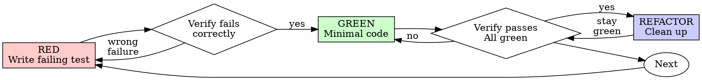

# Test-Driven Development (TDD)

## Overview

Write the test first. Watch it fail. Write minimal code to pass.

**Core principle:** If you didn't watch the test fail, you don't know if it tests the right thing.

**Violating the letter of the rules is violating the spirit of the rules.**

## When to Use

**Always:**
- New features
- Bug fixes
- Refactoring
- Behavior changes

**Exceptions (ask your human partner):**
- Throwaway prototypes
- Generated code
- Configuration files

Thinking "skip TDD just this once"? Stop. That's rationalization.

## The Iron Law

```
NO PRODUCTION CODE WITHOUT A FAILING TEST FIRST
```

Write code before the test? Delete it. Start over.

**No exceptions:**
- Don't keep it as "reference"
- Don't "adapt" it while writing tests
- Don't look at it
- Delete means delete

Implement fresh from tests. Period.

## Red-Green-Refactor



### RED - Write Failing Test

Write one minimal test showing what should happen.

<Good>
```typescript
test('retries failed operations 3 times', async () => {
  let attempts = 0;
  const operation = () => {
    attempts++;
    if (attempts < 3) throw new Error('fail');
    return 'success';
  };

  const result = await retryOperation(operation);

  expect(result).toBe('success');
  expect(attempts).toBe(3);
});
```
Clear name, tests real behavior, one thing
</Good>

<Bad>
```typescript
test('retry works', async () => {
  const mock = jest.fn()
    .mockRejectedValueOnce(new Error())
    .mockRejectedValueOnce(new Error())
    .mockResolvedValueOnce('success');
  await retryOperation(mock);
  expect(mock).toHaveBeenCalledTimes(3);
});
```
Vague name, tests mock not code
</Bad>

**Requirements:**
- One behavior
- Clear name
- Real code (no mocks unless unavoidable)

### Verify RED - Watch It Fail

**MANDATORY. Never skip.**

```bash
npm test path/to/test.test.ts
```

Confirm:
- Test fails (not errors)
- Failure message is expected
- Fails because feature missing (not typos)

**Test passes?** You're testing existing behavior. Fix test.

**Test errors?** Fix error, re-run until it fails correctly.

### GREEN - Minimal Code

Write simplest code to pass the test.

<Good>
```typescript
async function retryOperation<T>(fn: () => Promise<T>): Promise<T> {
  for (let i = 0; i < 3; i++) {
    try {
      return await fn();
    } catch (e) {
      if (i === 2) throw e;
    }
  }
  throw new Error('unreachable');
}
```
Just enough to pass
</Good>

<Bad>
```typescript
async function retryOperation<T>(
  fn: () => Promise<T>,
  options?: {
    maxRetries?: number;
    backoff?: 'linear' | 'exponential';
    onRetry?: (attempt: number) => void;
  }
): Promise<T> {
  // YAGNI
}
```
Over-engineered
</Bad>

Don't add features, refactor other code, or "improve" beyond the test.

### Verify GREEN - Watch It Pass

**MANDATORY.**

```bash
npm test path/to/test.test.ts
```

Confirm:
- Test passes
- Other tests still pass
- Output pristine (no errors, warnings)

**Test fails?** Fix code, not test.

**Other tests fail?** Fix now.

### REFACTOR - Clean Up

After green only:
- Remove duplication
- Improve names
- Extract helpers

Keep tests green. Don't add behavior.

### Repeat

Next failing test for next feature.

## Good Tests

| Quality | Good | Bad |
|---------|------|-----|
| **Minimal** | One thing. "and" in name? Split it. | `test('validates email and domain and whitespace')` |
| **Clear** | Name describes behavior | `test('test1')` |
| **Shows intent** | Demonstrates desired API | Obscures what code should do |

## Why Order Matters

**"I'll write tests after to verify it works"**

Tests written after code pass immediately. Passing immediately proves nothing:
- Might test wrong thing
- Might test implementation, not behavior
- Might miss edge cases you forgot
- You never saw it catch the bug

Test-first forces you to see the test fail, proving it actually tests something.

**"I already manually tested all the edge cases"**

Manual testing is ad-hoc. You think you tested everything but:
- No record of what you tested
- Can't re-run when code changes
- Easy to forget cases under pressure
- "It worked when I tried it" ≠ comprehensive

Automated tests are systematic. They run the same way every time.

**"Deleting X hours of work is wasteful"**

Sunk cost fallacy. The time is already gone. Your choice now:
- Delete and rewrite with TDD (X more hours, high confidence)
- Keep it and add tests after (30 min, low confidence, likely bugs)

The "waste" is keeping code you can't trust. Working code without real tests is technical debt.

**"TDD is dogmatic, being pragmatic means adapting"**

TDD IS pragmatic:
- Finds bugs before commit (faster than debugging after)
- Prevents regressions (tests catch breaks immediately)
- Documents behavior (tests show how to use code)
- Enables refactoring (change freely, tests catch breaks)

"Pragmatic" shortcuts = debugging in production = slower.

**"Tests after achieve the same goals - it's spirit not ritual"**

No. Tests-after answer "What does this do?" Tests-first answer "What should this do?"

Tests-after are biased by your implementation. You test what you built, not what's required. You verify remembered edge cases, not discovered ones.

Tests-first force edge case discovery before implementing. Tests-after verify you remembered everything (you didn't).

30 minutes of tests after ≠ TDD. You get coverage, lose proof tests work.

## Common Rationalizations

| Excuse | Reality |
|--------|---------|
| "Too simple to test" | Simple code breaks. Test takes 30 seconds. |
| "I'll test after" | Tests passing immediately prove nothing. |
| "Tests after achieve same goals" | Tests-after = "what does this do?" Tests-first = "what should this do?" |
| "Already manually tested" | Ad-hoc ≠ systematic. No record, can't re-run. |
| "Deleting X hours is wasteful" | Sunk cost fallacy. Keeping unverified code is technical debt. |
| "Keep as reference, write tests first" | You'll adapt it. That's testing after. Delete means delete. |
| "Need to explore first" | Fine. Throw away exploration, start with TDD. |
| "Test hard = design unclear" | Listen to test. Hard to test = hard to use. |
| "TDD will slow me down" | TDD faster than debugging. Pragmatic = test-first. |
| "Manual test faster" | Manual doesn't prove edge cases. You'll re-test every change. |
| "Existing code has no tests" | You're improving it. Add tests for existing code. |

## Red Flags - STOP and Start Over

- Code before test
- Test after implementation
- Test passes immediately
- Can't explain why test failed
- Tests added "later"
- Rationalizing "just this once"
- "I already manually tested it"
- "Tests after achieve the same purpose"
- "It's about spirit not ritual"
- "Keep as reference" or "adapt existing code"
- "Already spent X hours, deleting is wasteful"
- "TDD is dogmatic, I'm being pragmatic"
- "This is different because..."

**All of these mean: Delete code. Start over with TDD.**

## Example: Bug Fix

**Bug:** Empty email accepted

**RED**
```typescript
test('rejects empty email', async () => {
  const result = await submitForm({ email: '' });
  expect(result.error).toBe('Email required');
});
```

**Verify RED**
```bash
$ npm test
FAIL: expected 'Email required', got undefined
```

**GREEN**
```typescript
function submitForm(data: FormData) {
  if (!data.email?.trim()) {
    return { error: 'Email required' };
  }
  // ...
}
```

**Verify GREEN**
```bash
$ npm test
PASS
```

**REFACTOR**
Extract validation for multiple fields if needed.

## Test Coverage Layers

TDD's Red-Green-Refactor discipline tells you *how* to write each test. It
does **not** tell you *how many kinds of test* your code needs. "I have
passing unit tests" is not the same as "this code is tested." Every
non-trivial piece of code needs its appropriate slice of these three layers,
plus targeted boundary / stress / concurrency tests.

### Unit
Pure functions, single-class logic, utilities. Fast (< 50ms each), no
network, no disk, no real external systems. This is what most TDD examples
show. Necessary but rarely sufficient.

### Integration
Module-to-module contracts. Real DB (use testcontainers or an ephemeral
instance — not a mock). Real HTTP handlers (invoke your router, don't
stub it). Real message queues if your code uses them. The goal: if two
modules have a wire-format mismatch, these tests catch it; pure unit tests
won't.

**When in doubt:** if your code talks to a process you don't own (DB, queue,
HTTP service), there must be at least one integration test that hits a real
instance of that process.

### End-to-End
For user-facing code: Playwright / Cypress / equivalent running the actual
user journey. For CLIs: subprocess the binary with real args. For servers:
start the server, fire real requests. E2E tests are slower — you don't run
one per function, you run one per user-visible flow.

## Boundary / Stress / Concurrency

Unit + integration + E2E gives coverage *width*. These three give *depth*.
Most production bugs live here.

### Boundary (every public function needs these)
- **Empty / null / undefined** — `""`, `[]`, `{}`, `None`, `null`, missing argument
- **Single element** — list of one, map of one key, string of one char
- **Max / overflow** — `MAX_INT`, largest-realistic input, buffer-sized input + 1
- **Invalid** — wrong type, malformed JSON, bad UTF-8, unclosed quotes
- **Date edge cases** — leap year (Feb 29), DST transitions, timezone flips, pre-1970 timestamps, Y2K38

### Stress (latency-sensitive or high-throughput paths)
Use the language's standard benchmark tool and assert a concrete threshold.
Don't just "measure" — **assert**:

| Language | Tool | Assertion style |
|---|---|---|
| Go | `testing.B` + `go test -bench=.` | `if b.Elapsed() > X { b.Fatal(...) }` |
| Rust | `criterion` | `criterion_group!` + regression threshold |
| JS/TS | `tinybench` or `autocannon` for HTTP | `expect(p99).toBeLessThan(X)` |
| Python | `pytest-benchmark` | `benchmark.pedantic(..., rounds=N)` + assert |
| Java/Kotlin | JMH | `@Benchmark` + external threshold check |
| Swift | XCTest `measure { }` | `XCTMetric` with baseline |
| Any | `k6`, `wrk`, `artillery` | CLI script with SLO assertions |

At minimum, one stress test per service/endpoint that names a p99 latency
or throughput target. If you don't know the target, that itself is a
problem — ask, or pick a conservative one and mark it `TODO: revisit`.

### Concurrency (MANDATORY for any code touching shared state)

If the code uses threads, goroutines, async/await with shared state, or
runs behind a web server that serves concurrent requests — a concurrency
test is required. "I read the code and it looks safe" is not a test.

| Language | Race / concurrency tool |
|---|---|
| Go | `go test -race` — always run with `-race` on anything touching shared memory |
| Rust | `loom` crate for model checking; Miri for UB; `cargo test --release` with N-thread stress |
| Java/Kotlin | JCStress for memory-model bugs; `CompletableFuture.allOf` for multi-thread fuzz; `ExecutorService` + barriers |
| JS/TS | `Promise.all(Array(N).fill(op()))` for async races; for workers: actual worker threads with shared ArrayBuffer |
| Python | `threading` + `pytest-xdist -n auto`; `hypothesis` strategies with `@given` for async fuzz |
| Swift | Thread Sanitizer (`-sanitize=thread`); actor-based code needs explicit reentrancy tests |
| C/C++ | TSan (`-fsanitize=thread`); Helgrind; ASan for use-after-free in callbacks |

Write a test that **intentionally** tries to expose the race: N threads or
N concurrent async calls hitting the same code path, with assertions on
the final state. Run it under the race detector. Run it many times
(≥ 100 iterations) — races are probabilistic.

**Not applicable?** Only when the code is genuinely single-threaded with no
shared mutable state and no async I/O. State that in your self-review so
a reviewer can confirm.

## Verification Checklist

Before marking work complete:

- [ ] Every new function/method has a test
- [ ] Watched each test fail before implementing
- [ ] Each test failed for expected reason (feature missing, not typo)
- [ ] Wrote minimal code to pass each test
- [ ] All tests pass
- [ ] Output pristine (no errors, warnings)
- [ ] Tests use real code (mocks only if unavoidable)
- [ ] Edge cases and errors covered
- [ ] **Unit + integration + E2E coverage matches this code's actual surfaces** (or justified "not applicable" per layer)
- [ ] **Boundary tests** for every public function (null/empty/max/invalid/date-edge)
- [ ] **Stress test with a concrete assertion** for latency- or throughput-sensitive code (or "not applicable" with rationale)
- [ ] **Concurrency test under the language's race detector** for any code touching shared state (or "not applicable" with rationale)

Can't check all boxes? You skipped TDD. Start over.

## When Stuck

| Problem | Solution |
|---------|----------|
| Don't know how to test | Write wished-for API. Write assertion first. Ask your human partner. |
| Test too complicated | Design too complicated. Simplify interface. |
| Must mock everything | Code too coupled. Use dependency injection. |
| Test setup huge | Extract helpers. Still complex? Simplify design. |

## Debugging Integration

Bug found? Write failing test reproducing it. Follow TDD cycle. Test proves fix and prevents regression.

Never fix bugs without a test.

## Testing Anti-Patterns

When adding mocks or test utilities, read @testing-anti-patterns.md to avoid common pitfalls:
- Testing mock behavior instead of real behavior
- Adding test-only methods to production classes
- Mocking without understanding dependencies

## Final Rule

```
Production code → test exists and failed first
Otherwise → not TDD
```

No exceptions without your human partner's permission.
